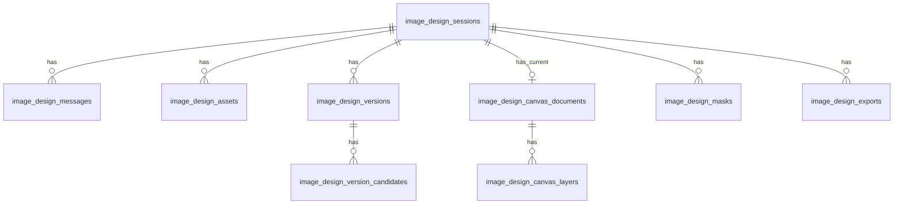

# 图片设计助手 数据库表设计 + API 设计

**状态**: Draft for implementation  
**日期**: 2026-03-15  
**目标版本**: MVP / M1

---

## 1. 设计原则

1. 会话、消息、版本、画布、素材分开建模。
2. 二进制文件进入对象存储，数据库只保存元数据与关系。
3. AI 版本与 Canvas 草稿都必须可追溯。
4. API 风格对齐当前仓库的 `app/api/*` route handlers 与 `requireSessionUser()` guard。
5. 默认所有接口要求登录；工作台接口还要求特性权限 `image_design_generation`。

---

## 2. 建议新增数据表

## 2.1 `image_design_sessions`

会话主表，对应一个设计工作流。

| 字段 | 类型 | 说明 |
|------|------|------|
| `id` | serial pk | 会话 ID |
| `user_id` | int not null | 创建人 |
| `enterprise_id` | int null | 企业归属，便于审计与企业级管理 |
| `title` | varchar(255) not null | 会话标题 |
| `status` | varchar(32) not null | `draft` / `active` / `archived` / `deleted` |
| `current_mode` | varchar(16) not null | `chat` / `canvas` |
| `current_version_id` | int null | 当前选中的版本节点 |
| `current_canvas_document_id` | int null | 当前画布文档 |
| `cover_asset_id` | int null | 会话封面图 |
| `created_at` | timestamp | 创建时间 |
| `updated_at` | timestamp | 更新时间 |
| `archived_at` | timestamp null | 归档时间 |

索引建议：

- `(user_id, updated_at desc)`
- `(enterprise_id, updated_at desc)`

---

## 2.2 `image_design_messages`

保存聊天消息与操作记录。

| 字段 | 类型 | 说明 |
|------|------|------|
| `id` | serial pk | 消息 ID |
| `session_id` | int not null | 所属会话 |
| `role` | varchar(20) not null | `user` / `assistant` / `system` |
| `message_type` | varchar(32) not null | `prompt` / `result_summary` / `error` / `note` |
| `content` | text not null | 文本内容 |
| `task_type` | varchar(32) null | `generate` / `edit` / `blend` / `style_transfer` / `mask_edit` |
| `request_payload` | jsonb null | 精简版请求上下文 |
| `response_payload` | jsonb null | 文本说明或摘要 |
| `created_version_id` | int null | 若本消息产生版本节点，回填版本 ID |
| `created_at` | timestamp | 创建时间 |

索引建议：

- `(session_id, created_at asc)`

---

## 2.3 `image_design_assets`

统一素材表，承载上传图、生成图、快照图、mask 图、导出图。

| 字段 | 类型 | 说明 |
|------|------|------|
| `id` | serial pk | 素材 ID |
| `session_id` | int null | 关联会话 |
| `user_id` | int not null | 所属用户 |
| `asset_type` | varchar(32) not null | `reference` / `generated` / `canvas_snapshot` / `mask` / `sticker` / `export` |
| `reference_role` | varchar(32) null | `subject` / `background` / `style` / `logo` |
| `storage_provider` | varchar(32) not null | `r2` / `s3` |
| `storage_key` | text not null unique | 对象存储 key |
| `public_url` | text null | 受控可访问地址 |
| `mime_type` | varchar(100) not null | MIME 类型 |
| `file_size` | int not null | 字节数 |
| `width` | int null | 宽 |
| `height` | int null | 高 |
| `sha256` | varchar(64) null | 去重或校验 |
| `status` | varchar(20) not null | `pending` / `ready` / `failed` |
| `meta` | jsonb null | 其他元数据 |
| `created_at` | timestamp | 创建时间 |
| `updated_at` | timestamp | 更新时间 |

索引建议：

- `(session_id, created_at desc)`
- `(user_id, created_at desc)`
- `(asset_type, created_at desc)`

---

## 2.4 `image_design_versions`

版本树核心表。AI 生成、AI 编辑、Canvas 保存都写入版本节点。

| 字段 | 类型 | 说明 |
|------|------|------|
| `id` | serial pk | 版本 ID |
| `session_id` | int not null | 所属会话 |
| `parent_version_id` | int null | 父版本，支持分支 |
| `source_message_id` | int null | 来源消息 |
| `version_kind` | varchar(32) not null | `ai_generate` / `ai_edit` / `canvas_save` / `restore` |
| `branch_key` | varchar(64) null | 分支标识 |
| `provider` | varchar(32) null | `aiberm` |
| `model` | varchar(128) null | 模型名 |
| `prompt_text` | text null | 本次版本使用的 prompt |
| `snapshot_asset_id` | int null | 如由画布快照生成，记录快照 |
| `mask_asset_id` | int null | 局部编辑的 mask |
| `selected_candidate_id` | int null | 当前主稿候选 |
| `canvas_document_id` | int null | 对应的 canvas 文档 |
| `status` | varchar(20) not null | `processing` / `ready` / `failed` |
| `meta` | jsonb null | 参数、性能、错误信息等 |
| `created_at` | timestamp | 创建时间 |

索引建议：

- `(session_id, created_at desc)`
- `(parent_version_id)`
- `(branch_key, created_at asc)`

---

## 2.5 `image_design_version_candidates`

一个版本节点下的 1~4 张候选图。

| 字段 | 类型 | 说明 |
|------|------|------|
| `id` | serial pk | 候选 ID |
| `version_id` | int not null | 所属版本 |
| `asset_id` | int not null | 关联图片素材 |
| `candidate_index` | int not null | 顺序 0..n |
| `is_selected` | boolean not null | 是否当前主稿 |
| `score` | int null | 预留排序分 |
| `created_at` | timestamp | 创建时间 |

唯一约束建议：

- `(version_id, candidate_index)`

---

## 2.6 `image_design_canvas_documents`

画布当前文档主表，用于恢复工作态。

| 字段 | 类型 | 说明 |
|------|------|------|
| `id` | serial pk | 画布文档 ID |
| `session_id` | int not null | 所属会话 |
| `base_version_id` | int null | 底图来源版本 |
| `width` | int not null | 画布宽 |
| `height` | int not null | 画布高 |
| `background_asset_id` | int null | 当前底图素材 |
| `revision` | int not null | 乐观锁版本号 |
| `status` | varchar(20) not null | `draft` / `saved` / `failed` |
| `last_saved_at` | timestamp null | 最近保存时间 |
| `created_at` | timestamp | 创建时间 |
| `updated_at` | timestamp | 更新时间 |

索引建议：

- `(session_id, updated_at desc)`

---

## 2.7 `image_design_canvas_layers`

画布图层表。MVP 允许结构化落库，便于恢复和导出。

| 字段 | 类型 | 说明 |
|------|------|------|
| `id` | serial pk | 图层 ID |
| `canvas_document_id` | int not null | 所属画布文档 |
| `layer_type` | varchar(32) not null | `background` / `text` / `shape` / `image` / `brush` / `eraser` |
| `name` | varchar(255) not null | 图层名称 |
| `z_index` | int not null | 排序值 |
| `visible` | boolean not null | 是否显示 |
| `locked` | boolean not null | 是否锁定 |
| `transform` | jsonb not null | x/y/scale/rotation 等 |
| `style` | jsonb null | 颜色、描边、阴影、字体等 |
| `content` | jsonb null | 文本内容、路径点、形状类型等 |
| `asset_id` | int null | 图片型图层关联素材 |
| `created_at` | timestamp | 创建时间 |
| `updated_at` | timestamp | 更新时间 |

索引建议：

- `(canvas_document_id, z_index asc)`

---

## 2.8 `image_design_masks`

局部编辑所需的选区记录。

| 字段 | 类型 | 说明 |
|------|------|------|
| `id` | serial pk | mask ID |
| `session_id` | int not null | 所属会话 |
| `canvas_document_id` | int null | 来源画布 |
| `version_id` | int null | 关联版本 |
| `mask_type` | varchar(32) not null | `rect` / `lasso` / `brush` |
| `bounds` | jsonb not null | 选区 bounding box |
| `geometry` | jsonb null | 向量几何或点集 |
| `mask_asset_id` | int null | 位图 mask 素材 |
| `created_at` | timestamp | 创建时间 |

---

## 2.9 `image_design_exports`

导出审计表。

| 字段 | 类型 | 说明 |
|------|------|------|
| `id` | serial pk | 导出记录 ID |
| `session_id` | int not null | 所属会话 |
| `version_id` | int null | 来源版本 |
| `canvas_document_id` | int null | 来源画布 |
| `asset_id` | int not null | 导出后的素材 |
| `format` | varchar(16) not null | `png` / `jpg` / `webp` |
| `size_preset` | varchar(16) not null | `1:1` / `4:5` / `3:4` / `16:9` / `9:16` |
| `transparent_background` | boolean not null | 是否透明背景 |
| `created_at` | timestamp | 创建时间 |

---

## 3. 表关系概览



---

## 4. Drizzle 实现建议

建议在 `lib/db/schema.ts` 中新增对应表定义，并新增迁移脚本：

- `scripts/run-image-assistant-migration.js`

同时需要扩展：

- `lib/enterprise/constants.ts`
- `lib/runtime-features.ts`

新增 feature key：

- `image_design_generation`

---

## 5. API 设计总览

## 5.1 认证与权限

所有 `/api/image-assistant/*` 接口统一使用：

```ts
const auth = await requireSessionUser(request, "image_design_generation")
```

错误码约定：

- `401` 未登录
- `403` 无权限
- `410` 功能关闭
- `400` 参数错误
- `404` 资源不存在
- `409` revision 冲突
- `422` 业务校验失败
- `500` 服务端错误
- `504` 上游生成超时

---

## 5.2 会话接口

### `GET /api/image-assistant/sessions`

用途：
- 获取会话列表

查询参数：
- `limit`
- `cursor`

响应：

```json
{
  "data": {
    "items": [
      {
        "id": 101,
        "title": "夏季促销海报",
        "status": "active",
        "currentMode": "canvas",
        "coverAssetUrl": "https://...",
        "updatedAt": "2026-03-15T11:30:00.000Z"
      }
    ],
    "nextCursor": "101"
  }
}
```

### `POST /api/image-assistant/sessions`

用途：
- 新建空会话

请求：

```json
{
  "title": "未命名设计"
}
```

---

## 5.3 单会话详情接口

### `GET /api/image-assistant/sessions/:sessionId`

返回：

```json
{
  "data": {
    "session": {},
    "currentVersion": {},
    "canvasDocument": {},
    "assets": [],
    "messages": [],
    "versionTree": []
  }
}
```

### `PATCH /api/image-assistant/sessions/:sessionId`

用途：
- 改标题
- 更新 `currentMode`
- 更新当前版本或当前画布指针

### `DELETE /api/image-assistant/sessions/:sessionId`

用途：
- 软删除会话

---

## 5.4 消息接口

### `GET /api/image-assistant/messages?sessionId=...`

用途：
- 拉取消息流

### `POST /api/image-assistant/messages`

用途：
- 可选；如需要把单纯文字 note、用户手动备注写入消息流

MVP 可选，不一定必须首版落地。

---

## 5.5 资产上传接口

### `POST /api/image-assistant/assets/upload`

用途：
- 申请上传签名并创建 pending asset

请求：

```json
{
  "sessionId": 101,
  "fileName": "product.png",
  "mimeType": "image/png",
  "fileSize": 842132,
  "referenceRole": "subject"
}
```

响应：

```json
{
  "data": {
    "assetId": 501,
    "uploadUrl": "https://...",
    "storageKey": "image-assistant/12/101/reference/....png"
  }
}
```

### `POST /api/image-assistant/assets/:assetId/complete`

用途：
- 上传完成后回填宽高与 ready 状态

请求：

```json
{
  "width": 1200,
  "height": 1200,
  "fileSize": 842132
}
```

---

## 5.6 生成接口

### `POST /api/image-assistant/generate`

用途：
- 文生图或参考图生成

请求：

```json
{
  "sessionId": 101,
  "prompt": "做成夏季促销主视觉，清爽、商业感强",
  "taskType": "generate",
  "referenceAssetIds": [501, 502],
  "referenceRoles": {
    "501": "subject",
    "502": "style"
  },
  "candidateCount": 4,
  "sizePreset": "4:5",
  "qualityMode": "high"
}
```

响应：

```json
{
  "data": {
    "messageId": 801,
    "versionId": 901,
    "candidates": [
      {
        "candidateId": 1001,
        "assetId": 701,
        "url": "https://..."
      }
    ],
    "textSummary": "已生成 4 张夏季促销方向候选图。"
  }
}
```

接口行为：

1. 写入用户 prompt 消息
2. 调用 provider
3. 保存返回图片为 asset
4. 创建 version 节点和 candidate 记录
5. 写 assistant 结果消息

---

## 5.7 编辑接口

### `POST /api/image-assistant/edit`

用途：
- 基于已有参考图或历史版本进行整图编辑

请求：

```json
{
  "sessionId": 101,
  "baseVersionId": 901,
  "prompt": "改成极简高级感，保留产品主体",
  "referenceAssetIds": [701],
  "candidateCount": 2,
  "qualityMode": "high"
}
```

和 `generate` 的差异：

- `edit` 强调来源版本与编辑语义
- `imageConfig` 可以不传或仅在指定尺寸时传

---

## 5.8 Canvas 保存接口

### `PUT /api/image-assistant/canvas`

用途：
- 保存当前画布文档和全部图层

请求：

```json
{
  "sessionId": 101,
  "canvasDocumentId": 301,
  "revision": 7,
  "width": 1080,
  "height": 1350,
  "backgroundAssetId": 701,
  "layers": [
    {
      "id": 1,
      "layerType": "text",
      "name": "主标题",
      "zIndex": 10,
      "visible": true,
      "locked": false,
      "transform": { "x": 80, "y": 96, "scaleX": 1, "scaleY": 1, "rotation": 0 },
      "style": { "fontSize": 64, "fontFamily": "Manrope", "fill": "#111111" },
      "content": { "text": "SUMMER SALE" }
    }
  ]
}
```

响应：

```json
{
  "data": {
    "canvasDocumentId": 301,
    "revision": 8,
    "savedAt": "2026-03-15T11:44:00.000Z"
  }
}
```

冲突策略：

- `revision` 不匹配返回 `409`

---

## 5.9 Canvas 快照编辑接口

### `POST /api/image-assistant/canvas-snapshot-edit`

用途：
- 把当前画布快照回流给 AI 做再次编辑

请求：

```json
{
  "sessionId": 101,
  "canvasDocumentId": 301,
  "baseVersionId": 901,
  "prompt": "把右上角改成霓虹灯字样",
  "snapshotAssetId": 702,
  "maskId": 401,
  "editMode": "masked"
}
```

服务端逻辑：

1. 校验快照和 mask 归属
2. 拼装 provider 请求
3. 返回新版本节点和候选图

---

## 5.10 版本恢复接口

### `POST /api/image-assistant/versions/:versionId/restore`

用途：
- 把任意历史版本设为当前工作版本

请求：

```json
{
  "restoreTarget": "session_current"
}
```

响应：

```json
{
  "data": {
    "currentVersionId": 901,
    "currentCanvasDocumentId": 301
  }
}
```

说明：

- 若目标版本没有 canvas document，可按该版本主稿重新生成底图文档

---

## 5.11 导出接口

### `POST /api/image-assistant/export`

用途：
- 记录导出行为
- 需要时接入服务端导出 fallback

请求：

```json
{
  "sessionId": 101,
  "versionId": 901,
  "canvasDocumentId": 301,
  "format": "png",
  "sizePreset": "4:5",
  "transparentBackground": false
}
```

MVP 策略：

1. 前端先完成渲染和下载
2. 导出成功后异步上报该接口记录日志
3. 若后续改为服务端导出，再把该接口升级为真正导出任务入口

---

## 5.12 可用性接口

### `GET /api/image-assistant/availability`

用途：

- 检查登录态
- 检查 feature gate
- 检查 provider key 是否齐全

响应：

```json
{
  "data": {
    "enabled": true,
    "reason": null,
    "provider": "aiberm",
    "models": {
      "highQuality": "gemini-3.1-flash-image-preview",
      "lowCost": "gemini-3.1-flash-image-preview"
    }
  }
}
```

---

## 6. 请求校验建议

所有写接口建议使用 `zod` 校验。

关键校验规则：

1. 单图大小 <= 10MB
2. 最多上传 5 张参考图
3. `candidateCount` 限制为 `1..4`
4. `sizePreset` 仅允许枚举值
5. `sessionId` / `versionId` / `assetId` 必须归属当前用户

---

## 7. 审计与埋点落点

服务端建议记录：

- `image.generate.started`
- `image.generate.succeeded`
- `image.generate.failed`
- `image.edit.started`
- `image.canvas.saved`
- `image.export.created`
- `image.version.restored`

前端事件名称采用产品 PRD 中的埋点命名。

---

## 8. MVP 落地建议

如果需要降低首版复杂度，数据库实现可分两阶段：

### MVP 最小表集
- `image_design_sessions`
- `image_design_messages`
- `image_design_assets`
- `image_design_versions`
- `image_design_version_candidates`
- `image_design_canvas_documents`
- `image_design_canvas_layers`

### M1.5 再补
- `image_design_masks`
- `image_design_exports`

但若一开始就要支持“Canvas -> AI 闭环”和导出审计，建议直接一次性建全 9 张表。
