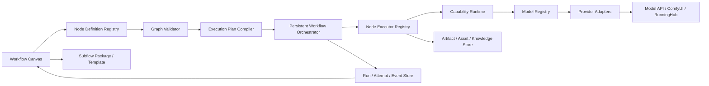
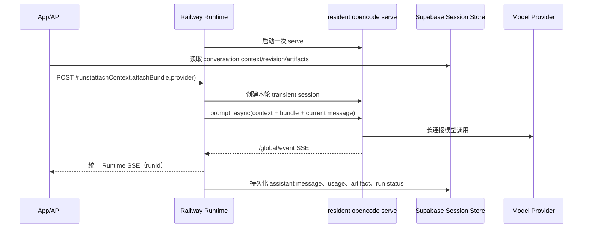

# Workflow 画布与运行时能力优化方案

**日期**: 2026-07-16

**适用项目**: `aimarketing-opencode-agent`

**文档类型**: 产品能力优化 + 技术架构方案 + 可执行实施计划

**当前项目基线**: `cb194162d627a7bdfa88d66c7e62606216f327c9`。实施分支开始前必须记录相对该提交的工作区差异；未提交工作区不能作为隐式接口依据。

**Infinite-Canvas 基线**: `29bff79066e614cb54ffa8e98b1992a14eb285a0`（2026-07-15）

**实施状态**: `IMPLEMENTED_M0_M3 / R1_SPEC_LOCKED_NOT_IMPLEMENTED`。M0-M3 已完成并通过本地 PostgreSQL migration（含重复执行）、真实 OpenAI-compatible mock Provider E2E（10 次连续运行、5 次强制重启恢复）和第 29.3 节性能门槛；迁移、E2E、性能原始报告分别保存在 `artifacts/workflow-canvas-m3/` 与 `docs/performance/workflow-canvas-m3.md`。Runtime R1 的 attach、transient session、Provider Credential Proxy 和外部运行状态合同已锁定，但代码尚未满足第 34 节 Runtime Gate。四个发布 Flag 仍需按第 34 节在正式环境完成安全检查与回滚演练后再扩大范围。M4-M6 属于后续独立里程碑，必须各自通过同等实施评审后才能开工。

> **面向实施 Agent**: 必须按第 31 节逐任务执行。每个任务先提交失败测试，再完成最小实现；不得把结构迁移、数据迁移和新运行行为合并为一个任务。

**目标**: 在不替换现有服务端 DAG 和企业治理底座的前提下，使 Workflow 能以声明式节点、语义端口和可恢复 iteration 完成批量生图。

**架构**: Canvas 只编辑版本化定义，Registry 声明节点，Plan Compiler 编译 DAG/foreach，Orchestrator 以 Revision/Iteration/Attempt 为事实来源，Provider Adapter 复用统一 AI Runtime。所有新行为由服务端 Feature Flag 控制并保持旧定义可读。

**技术栈**: Next.js、React、TypeScript、Drizzle/PostgreSQL、Node test runner（`tsx --test`）、Python E2E 脚本。

**全局约束**: M0-M3 不新增第三方依赖；不删除旧数据库字段；不改变 CLI Provider 范围；不绕过认证、租户、Credits、Artifact 和审计；上游复用必须与来源 manifest 和回归测试同提交。

**核心裁决**: 保留当前服务端 DAG、持久化运行、企业治理和资产体系。本项目当前属于本地测试版本，本期允许直接引入 Infinite-Canvas 中可补齐缺失能力的代码、HTML、CSS、图片、工作流模板和提示词，以缩短验证周期；引入内容必须记录来源、遵守上游许可证并经过当前架构适配，不以其单体架构替换现有生产底座。CLI 类 Provider 不进入本期方案，单独记录为后续桌面端方案。

**当前部署边界**: OpenCode Runtime、Business Agent、PPT 和 Workflow Agent 统一迁移到 Railway；Cloudflare Container/Sandbox 不属于当前实现、部署、压测或验收范围。历史 Cloudflare 方案文档保留用于决策追溯，但不再作为本方案的接口、存储或运行时依据。

| 能力 | 当前运行路径 | 本方案是否覆盖 |
| --- | --- | --- |
| 普通 AI Chat | 直接 AI SDK/Provider | 是，绕过 OpenCode Runtime |
| Business Agent | Railway 常驻 `opencode serve` + transient attach | 是 |
| PPT / Workflow Agent | Railway Runtime / 专用 Railway Worker | 是 |
| Cloudflare OpenCode Runner | 已迁移、停止新增接入 | 否 |

---

## 1. 背景与结论

当前 Workflow 已经不是一个简单的前端连线演示，而是具备以下生产基础：

- 当前基线为 16 类业务节点，覆盖上传、文本、Writer、LLM、Agent、图片、视频、数字人、音频、PPT、知识库和资产存储；M3 增加 `foreach`、`collect`、`output` 三类控制节点后，Registry 共 19 类。
- 类型化输入输出、悬空边校验、环检测、拓扑层级和同层并行执行。
- 节点级运行状态、Provider、Model、Task Run、Credits、错误和时间持久化。
- 失败运行恢复、节点重试、分支重试和失效运行回收。
- 企业身份、租户隔离、企业预设、知识治理、资产回流和 Workflow 发布为 Agent。

Infinite-Canvas 的优势不在企业运行底座，而在创作工具的功能密度：

- 图像、提示词、循环、分组、输出、ComfyUI、RunningHub、ModelScope、视频和 LTX Director 等创作节点。
- OpenAI 兼容、异步 API、Gemini、Volcengine、RunningHub、Jimeng CLI、Codex、Gemini CLI 等多协议接入。
- 串行/并行 Loop、批量引用、首尾帧角色、创作参数动态表单。
- 框选、多选、分组、撤销、复制粘贴、缩略图、自动布局、快速连线创建。
- 子图 JSON/ZIP 导入导出、携资源迁移、工作流组件入资产库。
- 裁剪、扩图、遮罩、画笔、缩放、宫格切分等画布内媒体处理。

因此，优化方向不是替换现有 Workflow，而是形成以下组合：

```text
当前项目的生产级执行与企业治理
+ Infinite-Canvas 的创作能力与画布效率
= 可扩展、可恢复、可治理的多模态 Workflow 平台
```

---

## 2. 证据基线

### 2.1 What already exists / 当前项目已具备的能力

| 能力 | 当前证据 | 裁决 |
| --- | --- | --- |
| 节点类型 | `lib/workflows/schema.ts` 定义当前基线 16 类节点；M3 控制节点完成后 Registry 为 19 类 | 保留并扩展，不另建平行节点系统 |
| 类型化边 | `WorkflowValueKind` 与 `inputName` 约束连接 | 升级为带角色、数量和必填约束的语义端口 |
| DAG 校验 | `lib/workflows/execution.ts` 校验重复节点、悬空边、类型和环 | 保留为唯一图校验入口 |
| 并行执行 | runnable 节点通过 `Promise.allSettled` 同层并行 | 保留；增加租户、Provider 和 Loop 维度并发限制 |
| 运行恢复 | `app/api/workflows/[workflowId]/run/route.ts` 支持兼容性判断和失败恢复 | 保留；扩展到 Loop iteration 和外部任务恢复 |
| 节点重试 | 节点或分支重跑，复用已成功上游结果 | 保留；增加 append-only attempt history |
| 执行持久化 | `lib/workflows/run-job.ts` 与 `lib/workflows/store.ts` 持久化节点状态和结果 | 继续作为 canonical runtime state |
| 企业治理 | 企业身份、预设、知识范围和资产持久化 | 所有新节点和 Provider 必须接入现有治理 |
| 模型契约 | `lib/ai-runtime/model-registry.ts` 已有 capability、参数 schema 和 timeout | 扩展现有注册体系，不在 Workflow 内硬编码模型 |

### 2.2 Infinite-Canvas 可借鉴的能力

上游证据固定到提交 [`29bff790`](https://github.com/hero8152/Infinite-Canvas/tree/29bff79066e614cb54ffa8e98b1992a14eb285a0)，避免后续更新造成引用漂移。

| 能力 | 上游证据 | 可借鉴内容 |
| --- | --- | --- |
| 创作节点 | [`canvas.js#L2442-L2630`](https://github.com/hero8152/Infinite-Canvas/blob/29bff79066e614cb54ffa8e98b1992a14eb285a0/static/js/canvas.js#L2442-L2630) | 节点产品语义、默认配置和交互规格 |
| 多协议 Provider | [`main.py#L2595-L2623`](https://github.com/hero8152/Infinite-Canvas/blob/29bff79066e614cb54ffa8e98b1992a14eb285a0/main.py#L2595-L2623) | Provider 能力描述、模型列表、端点覆盖和 LoRA 元数据 |
| 模型发现 | [`main.py#L12851-L13125`](https://github.com/hero8152/Infinite-Canvas/blob/29bff79066e614cb54ffa8e98b1992a14eb285a0/main.py#L12851-L13125) | 连接探测、模型拉取、能力分类 |
| Loop/Batch | [`canvas.js#L11720-L11832`](https://github.com/hero8152/Infinite-Canvas/blob/29bff79066e614cb54ffa8e98b1992a14eb285a0/static/js/canvas.js#L11720-L11832) | 串并行轮次、批次序号、停止和状态展示 |
| 子图导入导出 | [`canvas.js#L13562-L13775`](https://github.com/hero8152/Infinite-Canvas/blob/29bff79066e614cb54ffa8e98b1992a14eb285a0/static/js/canvas.js#L13562-L13775) | 选区导出、ID 重映射、携资源工作流包 |
| 画布效率 | [`canvas.js#L13338-L13560`](https://github.com/hero8152/Infinite-Canvas/blob/29bff79066e614cb54ffa8e98b1992a14eb285a0/static/js/canvas.js#L13338-L13560) | 多选、分组、复制粘贴和内部连线保留 |
| 自动布局 | [`canvas.js#L14038-L14141`](https://github.com/hero8152/Infinite-Canvas/blob/29bff79066e614cb54ffa8e98b1992a14eb285a0/static/js/canvas.js#L14038-L14141) | 按连接深度排列节点 |
| 媒体处理 | [`canvas.js#L4480-L5747`](https://github.com/hero8152/Infinite-Canvas/blob/29bff79066e614cb54ffa8e98b1992a14eb285a0/static/js/canvas.js#L4480-L5747) | 裁剪、扩图、遮罩、画笔、缩放和切分的产品规格 |
| 资产与日志 | [`canvas.js#L12007-L12093`](https://github.com/hero8152/Infinite-Canvas/blob/29bff79066e614cb54ffa8e98b1992a14eb285a0/static/js/canvas.js#L12007-L12093) | 生成请求、输入引用、耗时、输出和错误的可视化 |

### 2.3 允许复用与必须保留的边界

本地测试阶段允许直接复用：

- 节点创建、画布交互、媒体编辑、Loop、子图导入导出等相关 JavaScript/Python 代码。
- HTML、CSS、图片、图标和其它 UI 资源。
- 工作流模板、Provider 配置样例和动态字段定义。
- 系统提示词、提示词模板和素材分类规则。

直接复用不等于整体替换，以下边界保持不变：

- 不把上游单文件 `main.py`、经典画布脚本或智能画布脚本直接设为本项目 canonical runtime。
- 不使用本地 JSON 文件作为本项目 Workflow、资产或任务的 canonical storage。
- 不把任务状态保存在应用进程内。
- 不让前端承担 canonical orchestration、重试判定或结果结算。
- 不采用 CORS `*`、无认证 Provider 管理或本机凭证直接暴露方案。
- 引入的代码和资源必须拆分、适配到当前模块边界，并补充测试后才能进入本项目主流程。

---

## 3. 产品目标与非目标

### 3.1 产品目标

1. 新增节点时，主要改动收敛到一个节点定义和一个执行器模块。
2. 新增 Provider 或模型时，不修改画布组件和节点业务代码。
3. 生图、生视频、数字人、音频和外部工作流都使用统一能力与任务契约。
4. 支持批量、循环、子图复用、媒体预处理和外部工作流编排。
5. 支持复杂画布的高效编辑、恢复、导入导出和资产沉淀。
6. 所有新能力继承当前租户隔离、凭证治理、计费、审计和运行恢复能力。

### 3.2 NOT in scope / 非目标

- 本期不引入 Jimeng CLI、Codex CLI、Gemini CLI 等 CLI 类 Provider；相关能力留给后续桌面端方案。
- 不把 Infinite-Canvas 整体作为不可分割的运行时依赖或以其后端替换当前 Workflow runtime。
- 不在第一阶段实现真正包含回边的循环图。
- 不把条件分支宣称为 Infinite-Canvas 已验证能力；上游未发现 `condition/switch` 节点证据。
- 不在第一阶段实现多人实时 CRDT 协作。
- 不允许用户通过动态节点执行任意代码、任意命令或任意网络请求。
- 不一次性接入所有模型；先建立接入标准，再按业务价值逐批开放。
- 不新增或恢复 Cloudflare Container/Sandbox Runtime；当前所有 OpenCode 运行、状态恢复和压测只针对 Railway。
- 本期不承诺多 Replica 高并发；先落地单 Replica 常驻 `opencode serve`、Supabase context attach 与 Bundle hydration，扩容需通过第 4.1 节的队列、事件恢复和压测 Gate。

---

## 4. 总体架构



架构边界：

- Canvas 负责编辑、展示和发送版本化 Workflow 定义。
- Node Registry 负责节点声明，不负责执行长任务。
- Plan Compiler 把 DAG、Loop、Batch 和 Subflow 编译成可恢复执行计划。
- Orchestrator 是运行状态的唯一事实来源。
- Capability Runtime 负责统一模型能力调用。
- Provider Adapter 负责协议差异，不向 Workflow 泄漏供应商请求格式。
- Artifact/Asset 层负责媒体持久化，节点之间传递引用，不传递不可控大对象。

### 4.1 常驻 OpenCode Serve 与 Session/Bundle Attach（无状态 Runtime）

业务 Agent 和需要 OpenCode 能力的场景采用常驻 `opencode serve`，不再为每一轮对话启动 `opencode run` 子进程。`serve` 只提供无状态执行入口，不负责保存租户会话上下文；会话上下文的唯一事实来源是现有 Supabase 会话存储。每轮请求从 Supabase 读取上下文，通过 attach payload 临时加载到 OpenCode session，执行结束后由平台持久化结果。

这里的“attach”不是交互式终端命令 `opencode attach <url>`，而是平台把 Supabase context、Bundle 引用和本轮 Provider/model 附加到一次 OpenCode Serve 请求中。OpenCode session 可以是本轮临时 session，不能作为平台会话的持久化来源。



#### Attach 合同

| 信息 | 绑定方式 | 要求 |
| --- | --- | --- |
| Supabase context | `enterpriseId/userId + conversationId + revision/message cursor + artifact refs` | Supabase RLS 校验归属；Runtime 只读取签名或服务端授权的上下文，不自行维护长期副本 |
| OpenCode `sessionId` | 本轮 transient session，`runId -> sessionId` 临时映射 | 执行完成或失败后释放；不得作为平台会话来源 |
| Bundle | immutable `bundleKey/bundleVersion + selectedSkillIds` | Runtime 使用只读共享 Bundle 或本轮临时工作目录，版本命中则跳过重复准备 |
| Bundle 元数据 | attach payload 和本轮 workspace metadata | 记录 agent、skill bundle、版本，不记录 Provider secret |
| Provider/模型 | attach payload + prompt 的显式 `providerID/modelID` | 禁止隐式 fallback；只使用当前请求指定的 Provider/model |
| 事件 | 常驻 `/global/event` SSE 按 transient `sessionId` 映射到 `runId` | 只向当前 run 返回事件，终态写回 Supabase/运行状态表 |

Bundle 没有 OpenCode 原生的独立 attach API，因此本方案使用“bundle hydration”：从受治理的共享 Bundle Store 读取 immutable bundle，按需挂载或准备到本轮 workspace，再通过 session metadata 和 prompt 上下文附加其身份。所有 bundle、HTML、CSS、图片、工作流模板和提示词仍须遵守第 33 节导入 Manifest。

#### Attach 请求的最小合同

R1 由应用 API 先通过 Supabase RLS 读取 canonical conversation，再生成有界快照并签名；Runtime 不接受浏览器直接提交的历史消息、文件路径、租户字段或 Provider secret。R1 使用快照，R2 可在不改变语义的前提下改为签名引用：

```ts
type OpenCodeAttachRequest = {
  runId: string
  idempotencyKey: string
  context: {
    enterpriseId: number
    userId: number
    conversationId: string | null
    revision: number | null
    contextHash: string
    expiresAt: string
    signature: string
    messages: Array<{ role: "user" | "assistant" | "tool"; content: string }>
    summary: string | null
    artifactRefs: Array<{ artifactId: number; title: string; kind: string; summary: string }>
  }
  bundle: {
    bundleKey: string | null
    bundleVersion: string
    selectedSkillIds: string[]
  }
  provider: {
    providerId: string
    modelId: string
    credentialRef: string
  }
}
```

合同约束：

- `contextHash = SHA-256(canonicalJson({ revision, messages, summary, artifactRefs }))`；`messages` 最多保留最近 20 条，整个 context（包含 system prompt、附件摘要和 workflow context）不超过 60,000 个字符。
- `signature` 固定为 `v1.<base64url(canonicalJson(payload))>.<base64url(HMAC-SHA256(attachSigningSecret, canonicalJson(payload)))>`；canonical JSON 使用 UTF-8、对象键字典序、数组原序、无空白和 UTC ISO-8601 时间。
- Attach 签名密钥使用 `kid` 选择，接受当前和上一个 key，默认有效期 5 分钟；轮换期间旧 key 只允许验证，不允许签发。
- Runtime 必须拒绝签名过期、hash 不匹配、`kid` 无效、租户字段不一致、context 超限或 revision 不可接受的请求，并分别返回 `attach_signature_invalid`、`attach_context_hash_mismatch`、`attach_context_too_large` 或 `conversation_revision_conflict`。
- `sessionKey` 仍可作为应用层幂等和观测维度，但不得映射为跨轮 OpenCode native session。
- R1 唯一采用 Provider Credential Proxy：Runtime 只提交 `credentialRef/providerId/modelId/runId/expiresAt/signature`，Proxy 返回短生命周期的 Provider 路由；Railway Runtime 不持有或落盘租户 Provider API Key。请求体、日志、Bundle 和 workspace 不得出现原始 API Key。
- OpenCode native `sessionId` 只在 `runId` 生命周期内存在，终态后释放；重试创建新的 native session，不恢复上一次的隐藏上下文。

Provider Credential Proxy 的 R1 合同固定为：

```text
POST /internal/provider-proxy/routes
Authorization: Bearer <RUNTIME_PROXY_TOKEN>

{
  "credentialRef": "cred_...",
  "providerId": "deepseek",
  "modelId": "deepseek-v4-pro",
  "runId": "uuid",
  "expiresAt": "2026-07-18T12:05:00.000Z",
  "signature": "v1..."
}

200 {
  "routeBaseUrl": "https://provider-proxy.internal/v1/routes/route_...",
  "routeToken": "opaque-short-lived-token",
  "expiresAt": "2026-07-18T12:05:00.000Z"
}
```

Proxy 只返回不超过 60 分钟的 route；route 绑定 `enterpriseId/providerId/modelId/runId`，只允许对应模型请求，过期、重复使用或模型不匹配分别返回 `provider_route_expired`、`provider_route_replay` 或 `provider_route_model_mismatch`。Runtime 将 `routeBaseUrl/routeToken` 仅保存在本轮内存或临时 native session 配置中，终态立即清理；任何 Proxy 响应不得被写入运行状态表。

#### R1 外部运行状态合同

Railway Runtime 的进程内 Map 只能作为缓存。R1 必须使用 Supabase/Postgres 作为恢复依据。工作流任务继续使用 `AI_MARKETING_platform_opencode_runtime_runs/events`；当前 AI Chat/Business Agent 直连 Railway 的 `task_run_id` 不存在，因此使用配套的 `AI_MARKETING_platform_railway_opencode_runtime_states/events` 状态表，避免伪造任务行或把 transient native session 写入历史运行表。两组表都执行增量 migration，不得直接删表重建：

```sql
CREATE TABLE "AI_MARKETING_platform_opencode_runtime_runs" (
  id BIGSERIAL PRIMARY KEY,
  runtime_run_id UUID NOT NULL UNIQUE,
  task_run_id INTEGER NOT NULL UNIQUE,
  idempotency_key VARCHAR(128) NOT NULL UNIQUE,
  enterprise_id BIGINT NOT NULL,
  user_id BIGINT NOT NULL,
  conversation_id VARCHAR(128),
  conversation_revision BIGINT,
  context_hash CHAR(64) NOT NULL,
  bundle_key VARCHAR(255),
  bundle_version VARCHAR(128) NOT NULL,
  provider_id VARCHAR(128) NOT NULL,
  model_id VARCHAR(128) NOT NULL,
  status VARCHAR(24) NOT NULL CHECK (status IN ('queued', 'running', 'waiting', 'succeeded', 'failed', 'cancelled', 'timed_out')),
  attempt INTEGER NOT NULL DEFAULT 0,
  lease_owner VARCHAR(128),
  lease_expires_at TIMESTAMPTZ,
  last_event_sequence INTEGER NOT NULL DEFAULT 0,
  last_error_code VARCHAR(128),
  last_error_message TEXT,
  created_at TIMESTAMPTZ NOT NULL DEFAULT NOW(),
  updated_at TIMESTAMPTZ NOT NULL DEFAULT NOW(),
  finished_at TIMESTAMPTZ
);

CREATE TABLE "AI_MARKETING_platform_opencode_runtime_events" (
  id BIGSERIAL PRIMARY KEY,
  runtime_run_id UUID NOT NULL REFERENCES "AI_MARKETING_platform_opencode_runtime_runs"(runtime_run_id) ON DELETE CASCADE,
  sequence INTEGER NOT NULL,
  event JSONB NOT NULL,
  created_at TIMESTAMPTZ NOT NULL DEFAULT NOW(),
  UNIQUE(runtime_run_id, sequence)
);
```

直连 Railway 的状态表保持相同的 append-only sequence 合同：`railway_opencode_runtime_states(runtime_run_id, status, next_sequence, error)` 保存索引和终态，`railway_opencode_runtime_events(runtime_run_id, sequence, event, created_at)` 保存事件；写入时对状态行加锁后插入事件并递增 `next_sequence`，读取按 `sequence >= after` 排序。

现有共享表中的 `backend`、`dispatch_key`、`workflow_instance_id`、`sandbox_id`、`workspace_backup`、`billing_payload` 等历史字段必须保留用于数据迁移兼容；当前不再创建或调度 Cloudflare Runtime。`backend = 'railway-opencode'` 的记录必须将 `opencode_session_id` 保持为 `NULL`，不得把 Railway transient native session 写入该列。R1 migration 至少需要新增 `idempotency_key`、`enterprise_id`、`context_hash`、`bundle_key`、`bundle_version`、`provider_id`、`model_id`、`conversation_revision`、`last_event_sequence` 字段和对应唯一/索引约束，并创建 events 表。

状态写入规则：应用在 dispatch 前创建 run；Runtime 以租约 claim；每个 SSE 事件按 `(runtimeRunId, sequence)` append-only 写入；终态和 `last_event_sequence` 使用同一 transaction 更新。重复 `idempotencyKey` 必须返回已有 run，不得创建第二次 Provider 调用。事件读取使用 `GET /runs/:runId?after=<sequence>`，只有数据库中不存在 run 时才返回 `404 run_not_found`。Runtime 重启、Replica 漂移或 SSE 断开不能删除或重置已写入事件。

R1 固定 API：

| API | 成功结果 | 必须处理的失败 |
| --- | --- | --- |
| `POST /sessions/prepare` | `200 { prepared: true, sessionReady: true, bundleVersion, contextHash, expiresAt }`；不得返回 `openCodeSessionId` | `400 attach_*`、`409 conversation_revision_conflict` |
| `POST /runs` | `200 text/event-stream`；首帧 `runtime_started`，终帧 `done` 或 `runtime_error` | 重复幂等键重放已有事件；Provider 错误不得 fallback |
| `GET /runs/:runId?after=N` | `200 { runId, status, nextSequence, events, error }` | 仅数据库无记录时 `404` |
| `POST /runs/:runId/cancel` | `200 { runId, status: "cancelled" }` | 已终态返回当前终态，不重复取消 |

Runtime 通过受控内部状态写入端点更新上述表；不向 Railway 容器注入 Supabase service key。内部状态端点使用独立 `RUNTIME_STATE_TOKEN`，Provider Proxy 使用独立 `RUNTIME_PROXY_TOKEN`，并分别校验 `runtimeRunId`、tenant fields、credentialRef 和 sequence 单调性。

#### 当前实现必须完成的校正

本节是实施合同，不是可选优化。现有实现中发现的持久 session、客户端历史直传、Runtime 进程内运行状态和 workspace 凭证写入，必须在 R1 退出前消除：

| 当前偏差 | R1 修正 | 验收证据 |
| --- | --- | --- |
| `.opencode-session-bindings.json` 持久化 `sessionKey -> sessionId` | 删除持久映射；仅保留 `runId -> sessionId` 的进程内临时映射，并在终态清理 | 删除 Railway Volume 后重启，仍可从同一 Supabase revision 重新运行 |
| `sessions/prepare` 创建并返回 native session | 改为 readiness、Bundle 版本和 context 合同校验；不得创建业务持久 session，也不得返回可复用的 native session ID | prepare 后首次 `/runs` 才创建 transient session |
| `/api/ai/chat` 主要使用客户端 `normalizedMessages` | 服务端先调用 AI Entry repository 读取 canonical messages、summary、artifacts，再生成签名 bounded snapshot | 篡改客户端历史不会改变 Runtime 上下文；revision/hash 不匹配返回 409 |
| `opencode.json` 写入 Provider `apiKey` | 改为 R1 固定的 Provider Credential Proxy；OpenCode 只访问带短期签名路由的 Proxy | workspace、日志、SSE 和 Volume 扫描不到原始 Provider secret |
| Runtime `runRecords`、event offset 只在进程内存 | 使用锁定的 `AI_MARKETING_platform_opencode_runtime_runs/events` 保存 run status、事件序号、错误和终态；内存只作缓存 | Runtime 重启或 SSE 断线后可按 runId 恢复，不能返回 `run_not_found` |
| Bundle 复制到持久 session 目录并可写 | Bundle Store 版本化、immutable、只读挂载；每个 run 只有独立临时 workspace | 不同 run/租户不能修改或读取彼此 Bundle 和文件 |

这组修正完成前，代码只能标记为“常驻 Serve 技术预研”，不能标记为“Supabase 无状态 Session Attach 已完成”。

#### Supabase 会话与租户边界

多租户仍由现有 Supabase/Auth/RLS 和应用 API 负责；`opencode serve` 不保存租户 session，也不承担租户 session/workspace/event 的持久隔离。

- 应用先通过 Supabase RLS 读取正确的 conversation revision、message、artifact 和 skill bundle 引用，再生成签名 attach 请求。
- Runtime 只接受服务端签名的 context reference 或已裁剪的 context snapshot，不接受客户端任意文件路径和任意租户字段。
- Runtime 事件按 `runId` 返回，最终消息、usage、artifact 和状态写回现有 Supabase 表；租户查询仍由应用 API 的 RLS/授权完成。
- Provider secret 不写入 Supabase 会话正文；由 Runtime 的短生命周期配置或密钥服务提供，并在请求结束后释放。
- `opencode serve` 不是 OS 级安全沙箱；工具、网络和命令权限仍需由容器/沙箱限制。

#### 并发能力与明确限制

常驻 Serve 支持不同 run 并行；由于上下文由 Supabase attach，每个 run 可以使用独立的 transient OpenCode session。相同 conversation 的并发写入由 Supabase revision/idempotency 或应用队列控制。当前单 Replica 方案是“可并发”而非“高并发就绪”：

- 不同 run：允许并行，受 Runtime CPU、内存、Provider 连接数和现有业务配额共同限制。
- 相同 conversation：必须使用 revision compare-and-set 或 idempotency key 防止上下文覆盖；冲突返回 `409 conversation_revision_conflict`。
- PPT、图片、视频等重任务：必须与普通 Business Agent 分离资源池，避免互相争抢资源。
- `runRecords`、pending runs 和 event offset 不能只依赖进程内存；Supabase 运行状态表或等价外部存储是恢复依据。
- 当前单 Replica 不承诺高并发吞吐；不得在没有压测和背压的情况下直接增加 Railway Replica。

高并发目标架构为：

```text
请求入口
  -> 业务配额与队列
  -> 按 runId/任务分片路由
  -> 多个 Railway Runtime Replica
  -> 每个 Replica 一个 resident opencode serve
  -> Supabase context + 外部运行状态存储
  -> SSE / 事件总线
```

扩容前必须补齐：

1. runId 到 Runtime/event consumer 的可恢复路由，不能依赖单进程内存。
2. 业务、Provider、模型和 Runtime 四层并发上限。
3. 队列、背压、超时、取消和恢复协议；过载时返回可追踪的 queued 状态。
4. Supabase/Redis/Postgres 运行状态、幂等键、事件 offset 和失败恢复。
5. 资源隔离、内存上限、PPT/媒体专用 worker pool 和 OOM 保护。
6. Provider 连接池、速率限制和 fail-fast 熔断；本项目禁止通过 Provider fallback 隐式切换模型。

#### Serve Runtime 验收门槛

- Runtime 启动日志明确包含 `opencode_serve_ready`，健康检查返回 `opencodeServe=true`。
- 同一 conversation 的两次请求从 Supabase 读取同一 revision 时，能够构造等价 attach context；OpenCode `sessionId` 可以不同。
- Runtime 重启后不依赖 OpenCode session mapping；重新从 Supabase attach 即可恢复上下文。
- 不同 run 的事件、文件、产物和 Provider 配置不会串流；最终状态可从 Supabase 恢复。
- 同一 conversation 的并发提交有明确的 revision conflict、idempotency 或排队结果，不允许静默覆盖上下文。
- 使用支持 SSE 的 Mock Provider 完成 `text_delta -> usage -> done` 端到端验证；真实 Provider 另行验证延迟、限流和成本。
- 高并发上线前至少完成 10/25/50/100 个不同 run/conversation attach 的压测，并记录 P50/P95 排队、首事件、完成、错误率、内存和 Provider 限流指标。

本节是 Runtime 方案边界：本期可以落地单 Replica 的常驻 Serve、Supabase context attach 和 Bundle hydration；多 Replica 高并发、外部队列和恢复型事件消费属于后续扩容里程碑，不得在当前能力上作高并发承诺。

---

## 5. P0：声明式 Node Definition Registry

### 5.1 当前问题

当前一个节点类型的信息分散在以下位置：

- `lib/workflows/schema.ts`：类型、标题、输入输出。
- `components/workflows/workflow-node-palette.tsx`：顺序、图标和颜色。
- `components/workflows/workflow-canvas.tsx`：视觉和端口。
- `components/workflows/workflow-node-editor-fields.tsx`：配置表单。
- `lib/workflows/node-executors.ts`：执行器。
- `lib/workflows/capability-invoker.ts`：能力路由和供应商参数转换。

这会让“增加节点定义”演变成跨多个大文件同步修改，容易出现 UI 已展示但执行器缺失、端口与输出不一致、旧版本无法迁移等问题。

### 5.2 概念契约

以下类型用于说明 Registry 边界；实施时以第 24.3 节最终接口为准：

```ts
type WorkflowNodeDefinition = {
  type: string
  version: number
  category: "input" | "control" | "ai" | "media" | "integration" | "output"
  title: Record<"zh" | "en", string>
  icon: string
  inputs: WorkflowPortDefinition[]
  outputs: WorkflowPortDefinition[]
  configSchema: WorkflowFieldDefinition[]
  defaultConfig: Record<string, unknown>
  execution: {
    executorId: string
    capability?: string
    sideEffect: "none" | "external" | "persistent"
  }
  validation?: WorkflowNodeValidationRule[]
  migration?: WorkflowNodeMigration[]
}
```

注册表必须驱动：

- 节点库分类和搜索。
- 节点卡片标题、图标、颜色和帮助信息。
- 输入输出端口及连线校验。
- 默认配置和动态表单。
- Workflow schema 校验。
- Executor 解析。
- 导入导出依赖检查。
- 节点版本迁移。

### 5.3 验收标准

- 新增一个不含特殊 UI 的节点，不需要修改 `workflow-canvas.tsx`。
- 注册表启动时验证每个节点都有 executor、端口和 config schema。
- 未知节点类型不能被静默丢弃，必须以 `unsupported_node_type` 明确拒绝或只读展示。
- 每个持久化节点包含 `nodeVersion`，旧版本通过显式 migration 升级。

---

## 6. P0：Provider 与模型接入体系

本节应与既有的[统一模型接入架构优化方案](./2026-06-23-unified-model-runtime-architecture-plan.md)保持一致，不建立第二套模型系统。

### 6.1 四层契约

| 层级 | 责任 | 禁止事项 |
| --- | --- | --- |
| `ProviderDefinition` | 协议、凭证、Base URL、区域、连接状态和租户策略 | 不包含具体 Workflow UI |
| `ModelDefinition` | capability、输入输出、参数 schema、价格、限制、异步特征 | 不直接执行 HTTP |
| `ProviderAdapter` | submit/query/cancel/normalize/upload | 不决定企业是否可用 |
| `CapabilityPolicy` | 企业允许范围、默认模型、降级、预算和人工审批 | 不解析供应商私有响应 |

### 6.2 建议扩展

1. Provider 连接测试和健康状态。
2. `/models` 或供应商目录发现，先进入候选区，管理员确认后发布。
3. 模型能力分类：文本、生图、图生图、文生视频、图生视频、首尾帧、数字人、音乐、语音、Upscale。
4. 模型级参数 schema：尺寸、比例、时长、分辨率、数量、质量、Seed、音频、真人限制等。
5. 异步任务统一：`submit -> taskId -> query -> cancel -> normalize`。
6. Provider 和模型级并发、超时、重试、熔断与速率限制。
7. 价格与 Credits 估算，运行前展示 Loop/Batch 的最大成本。
8. Provider 凭证只保存在服务端密钥系统，并按企业范围授权。

### 6.3 首批建议接入

本表表示长期能力优先级，不代表 M0-M3 实施授权；本期只实现第 22.5 节的 OpenAI Compatible 图片 Adapter，其余进入 M5。

| 批次 | Provider/能力 | 原因 |
| --- | --- | --- |
| P0-A | 补齐 OpenAI Official / OpenAI Compatible 图片与文本 adapter | 当前已有模型定义但 runtime 仍存在 unsupported 路径 |
| P0-B | Gemini 图片与视频 | 补足主流多模态能力和参考图路径 |
| P0-C | RunningHub Workflow/App 动态节点 | 当前已有 RunningHub 能力，可复用任务轮询和资产上传基础 |
| P1-A | ComfyUI Workflow | 满足私有模型、自定义工作流和局域网创作需求 |
| P1-B | Volcengine / ModelScope | 扩大国内模型和低成本模型覆盖 |

### 6.4 CLI 类 Provider：后续桌面端方案

Jimeng CLI、Codex CLI、Gemini CLI 等能力明确不进入本期 Workflow 优化范围。原因不是能力价值不足，而是它们依赖本机登录态、用户目录、桌面凭证、进程生命周期和本地文件访问，与当前 Web/SaaS runtime 的安全边界不同。

后续桌面端方案单独研究：

- 桌面端安全读取和刷新本机 CLI 登录态。
- CLI 进程启动、停止、超时、并发和崩溃恢复。
- 本地文件、临时目录和输出资产导入平台的权限边界。
- 桌面端与 Web Workflow 的 Provider capability 对齐。
- 本机凭证不上传服务端，服务端只接收标准化结果和可选任务状态。
- 离线运行、断网恢复和桌面端版本兼容。
- Codex/Gemini/即梦等 CLI 的许可证、账号条款和自动化调用限制。

本期可以保留上游 CLI Provider 的研究资料、字段设计和交互参考，但不得注册到当前 Workflow 模型选择器、不得加入本期 ProviderAdapter 实现任务，也不得作为本期验收依赖。

### 6.5 模型发布门槛

模型只有满足以下条件才能进入生产选择器：

- capability 和输入输出已声明。
- 参数 schema 与真实请求经过 contract test。
- submit/query/cancel 行为已定义，或明确声明不可取消。
- 超时、最大文件、最大参考图和内容限制已配置。
- Credits 计算或最低预算保护已配置。
- 输出已归一化为平台 Artifact。
- 租户权限和凭证来源明确。

---

## 7. P0：语义化端口与媒体引用

### 7.1 当前问题

当前端口主要区分 `text / asset / image / video / audio / ppt`。这足以避免明显类型错误，但不足以表达：

- 首帧与尾帧。
- 主参考图、风格参考图、角色参考图和商品参考图。
- Mask、Control Image、Depth、Pose 等控制输入。
- 单值、多值、至少一个、最多 N 个。
- 必填与可选输入。
- 一次生成的输出集合与单个选中输出。

### 7.2 目标契约

```ts
type WorkflowPortDefinition = {
  id: string
  valueKind: "text" | "asset" | "image" | "video" | "audio" | "ppt" | "workflow"
  role?: string
  required?: boolean
  cardinality: "one" | "many"
  minItems?: number
  maxItems?: number
  acceptedMimeTypes?: string[]
}
```

建议首批角色：

- `image.reference`
- `image.first_frame`
- `image.last_frame`
- `image.mask`
- `image.style_reference`
- `image.subject_reference`
- `video.reference`
- `audio.reference`
- `text.prompt`
- `text.negative_prompt`

### 7.3 连接与迁移规则

- 现有 `images` 端口迁移为 `image.reference[]`。
- 旧视频节点的第一、第二张图片可兼容映射为 first/last frame，但保存后必须写入明确角色。
- 端口角色不由数组顺序长期表达。
- 连接时立即校验类型、角色、数量和 MIME；运行前再次服务端校验。
- 删除或修改模型时，节点保留原配置并进入 `configuration_invalid`，不得自动切换到另一模型后静默执行。

---

## 8. P0/P1：节点能力扩充

### 8.1 控制与组合节点

| 节点 | 主要语义 | 实施要求 |
| --- | --- | --- |
| `output` | 显式指定最终输出、展示名和持久化策略 | 支持多输出，替代“无子节点即 final”的隐式规则 |
| `group` | 纯视觉分组 | 不影响执行语义，可折叠、移动和复制 |
| `subflow` | 引用版本化子图 | 明确输入输出映射、版本和依赖 |
| `foreach` | 对输入集合逐项运行作用域 | 编译为 iteration，不产生真实图回边 |
| `batch` | 将多个输入按大小分批 | 支持批大小、并发和余数策略 |
| `collect` | 汇总 iteration 输出 | 支持保持顺序、去重和失败项策略 |

`condition/switch` 可作为后续独立能力，但不是本次 Infinite-Canvas 迁移范围的直接结论。

### 8.2 外部工作流节点

| 节点 | 配置 | 输出 |
| --- | --- | --- |
| `runninghub_workflow` | workflow ID、动态字段、付款模式、实例类型 | image/video/audio/text artifacts |
| `runninghub_app` | app ID、动态字段 | 标准化 artifact 集合 |
| `comfy_workflow` | 实例、workflow JSON、公开输入和输出映射 | ComfyUI 标准输出 |
| `video_timeline` | 时间段、提示词、参考图、帧率、尺寸 | video artifact |

动态工作流必须经过服务端导入和审核：

- 解析公开输入，而不是把完整上游 JSON 直接暴露给普通用户。
- 保存 workflow 内容摘要和 checksum。
- 限制可访问 URL、文件路径、节点类型和输出大小。
- 检测 SSRF、内网访问、任意文件读取和恶意自定义节点风险。
- 对外部工作流版本变化给出兼容性提示，不静默覆盖映射。

### 8.3 媒体预处理节点

优先采用非破坏性节点，而不是直接覆盖原始资产：

| 节点 | 输入 | 输出 |
| --- | --- | --- |
| `image_crop` | image + crop rect/aspect | 新 image artifact |
| `image_resize` | image + width/height/fit | 新 image artifact |
| `image_mask` | image + mask drawing | mask artifact，可同时透传原图 |
| `image_outpaint` | image + target canvas + prompt | 新 image artifact |
| `image_upscale` | image + target resolution/model | 新 image artifact |
| `image_grid_split` | image + rows/cols/custom lines | image artifact[] |
| `video_frame_extract` | video + timestamps/interval | image artifact[] |
| `video_audio_extract` | video | audio artifact |

所有处理节点必须记录来源 Artifact、变换参数和父子关系，确保可追溯和可重新执行。

---

## 9. P1：Loop、Batch 与执行计划

### 9.1 设计原则

- Workflow Definition 保持无环 DAG。
- `foreach` 节点声明 iteration scope，由 Plan Compiler 展开或动态调度。
- 每轮有独立的 `iterationKey`、输入、输出、attempt 和 Credits。
- 并行数量受 Workflow、租户、Provider 和模型四级限制。
- 失败策略必须显式：`fail_fast / continue / retry_failed`。
- 用户停止运行时，Orchestrator 取消未开始 iteration，并尽力取消已提交上游任务。

### 9.2 概念执行数据

以下类型用于解释 iteration 粒度；最终表结构和状态机以第 25、27 节为准。

```ts
type WorkflowIterationState = {
  runId: number
  scopeNodeKey: string
  iterationKey: string
  index: number
  status: "queued" | "running" | "succeeded" | "failed" | "cancelled"
  inputPayload: Record<string, unknown>
  outputPayload: Record<string, unknown> | null
  creditsConsumed: number
}
```

### 9.3 成本与安全限制

- M0-M3 默认最大 iteration 数为 20，单次硬上限为 100；企业管理员只能调低确认阈值，不能绕过平台硬上限。
- 运行前计算最大任务数与预计 Credits，超过阈值要求确认。
- Provider 并发不能直接使用用户填写值，必须受平台硬上限控制。
- 每轮输出大小和累计 Artifact 数必须受限。
- 禁止 Loop 在运行时动态创建无限新 Loop。

### 9.4 重试语义

- 重试单个 iteration，不覆盖其他成功 iteration。
- 重试 collect 节点时默认复用已完成 iteration 输出。
- 修改 Loop 配置后，旧运行不允许直接 resume，应创建新 run。
- attempt history 追加保存，不能只覆盖节点当前状态。

---

## 10. P1：子图、模板与工作流包

### 10.1 目标能力

- 框选多个节点，复制并保留内部连线。
- 将选区保存为企业 Subflow Component。
- 导出纯定义 JSON。
- 导出携资源 ZIP。
- 导入到当前画布并重映射 ID。
- 将 Subflow 发布到企业资产库或模板库。

### 10.2 工作流包建议格式

```ts
type WorkflowPackageManifest = {
  format: "aimarketing-workflow-package"
  schemaVersion: number
  exportedAt: string
  workflow: {
    nodes: WorkflowDefinitionNode[]
    edges: WorkflowDefinitionEdge[]
    exposedInputs?: WorkflowPortDefinition[]
    exposedOutputs?: WorkflowPortDefinition[]
  }
  dependencies: {
    models: Array<{ providerId: string; modelId: string }>
    agents: Array<{ agentId: string }>
    datasets: Array<{ datasetId: number; scope: string }>
    assets: Array<{ logicalId: string; path?: string; checksum?: string }>
  }
}
```

### 10.3 导入规则

- 所有 nodeKey、edge 引用和 group item ID 必须重映射。
- 不导出 API Key、Cookie、内部签名 URL、用户路径或临时任务 ID。
- 企业 Agent、知识库和 Provider 依赖需要重新绑定，不能跨租户自动引用。
- 模型缺失时进入依赖修复界面。
- ZIP 文件执行 MIME、大小、路径穿越、压缩炸弹和 checksum 校验。
- Package schema 必须版本化，并提供 migration。

---

## 11. P1：画布生产力优化

### 11.1 第一批交互

1. 框选与多选。
2. 多节点移动、删除、复制、粘贴。
3. Group 创建、折叠、命名和取消分组。
4. Undo/Redo 命令栈。
5. Fit Selection、Fit All、缩略图导航。
6. 按 DAG 深度自动布局。
7. 从端口拖到空白处后打开兼容节点菜单。
8. 粘贴图片、视频、音频或 URL 直接创建输入节点。
9. 节点和连线右键菜单。
10. 未保存退出保护与可配置自动保存。

### 11.2 状态设计

建议把画布编辑动作表达为命令，而不是在多个组件中直接修改数组：

```ts
type WorkflowEditCommand =
  | { type: "nodes.move"; before: PositionMap; after: PositionMap }
  | { type: "nodes.add"; nodes: WorkflowDefinitionNode[] }
  | { type: "nodes.remove"; nodes: WorkflowDefinitionNode[]; edges: WorkflowDefinitionEdge[] }
  | { type: "edges.add"; edges: WorkflowDefinitionEdge[] }
  | { type: "edges.remove"; edges: WorkflowDefinitionEdge[] }
  | { type: "subgraph.paste"; nodes: WorkflowDefinitionNode[]; edges: WorkflowDefinitionEdge[] }
```

要求：

- 拖动一次只生成一个 history entry。
- 参数输入连续编辑按 debounce 合并，避免每个字符一个历史状态。
- Undo/Redo 只影响定义，不回滚已发生的外部生成任务。
- 运行中的 Workflow 默认锁定运行相关结构修改，或通过快照隔离当前 run。

### 11.3 大画布性能

- 节点和连线渲染读写分离，拖动时通过 `requestAnimationFrame` 合并更新。
- 只渲染可视区域内复杂预览，非可视节点使用轻量壳。
- 图片和视频使用缩略图，不在画布直接加载原始大文件。
- Minimap 使用简化几何数据，不复用完整节点 DOM。
- 设定 100、300、500 节点基准场景并持续回归。

---

## 12. P1/P2：画布内资产与提示词工作台

当前项目已有企业 Artifact、资产库、知识库和 `product_store` 节点，不应迁移 Infinite-Canvas 的本地目录资产模式。

### 12.1 建议能力

- 画布左侧或可停靠面板搜索企业资产。
- 按图片、视频、音频、PPT、工作流组件筛选。
- 从资产库拖入后创建引用节点，不重复上传。
- 生成结果一键入库，并选择分类、标签和可见范围。
- 保存提示词模板、负向提示词、变量和适用模型。
- 使用 LLM 生成素材描述和分类建议，但最终写入遵守企业治理。
- 显示资产来源 Workflow、Run、Node、Provider、Model 和父资产。

### 12.2 权限边界

- 私人资产、企业资产和公共模板必须分开授权。
- 导入的 Subflow 不得自动获得源租户资产权限。
- 临时签名 URL 不写入长期 Workflow Definition。
- 删除资产时先检查 Workflow 和运行历史引用；历史记录保留不可执行的 tombstone 信息。

---

## 13. P1/P2：运行可观测性与尝试历史

### 13.1 当前基础

当前运行记录已经保存节点状态、Provider、Model、Task Run、Credits、错误和时间。下一步不是重建日志，而是补齐创作上下文和多次尝试。

### 13.2 建议增加

- `node_execution_attempts` 追加式记录。
- `providerRequestId`、上游 task ID、提交时间和轮询次数。
- 实际发送的参数快照，敏感字段脱敏。
- 输入 Artifact 引用和输出 Artifact 引用。
- Prompt、Negative Prompt、Seed、尺寸、时长和模型版本。
- Queue、Provider、Generation、Persistence 分段耗时。
- 每次重试原因：用户重试、自动重试、恢复、Provider 降级。
- 节点卡片内最近一次输出与 attempt 切换。

### 13.3 推荐状态层级

```text
Workflow Run
  -> Node Execution
      -> Iteration（可选）
          -> Attempt 1
          -> Attempt 2
              -> Provider Task
              -> Events
              -> Artifacts
```

### 13.4 运行详情验收

- 用户能判断失败发生在排队、上传、提交、生成、轮询还是持久化。
- 用户可重试节点、分支或单个 iteration。
- 管理员可按 Provider、Model、错误码和耗时聚合。
- Credits 结算与实际成功/失败 attempt 对齐。

---

## 14. 自动保存、版本与协作

### 14.1 第一阶段

- Builder 保留本地 dirty state。
- 结构或配置变化后 debounce 自动保存。
- 保存请求携带 `definitionVersion` 或 `updatedAt`。
- 服务端使用乐观锁拒绝旧版本覆盖。
- 冲突时展示“重新加载 / 另存副本 / 查看差异”，不做静默 last-write-wins。
- Viewport 和个人面板位置与 Workflow 业务定义分开保存，避免无意义版本冲突。

### 14.2 第二阶段

- 保存 Workflow revision，用于审计、比较和回滚。
- Run 永远引用启动时的 immutable revision。
- 模板和 Subflow 记录发布版本，草稿更新不影响已运行版本。

### 14.3 暂不实施

真正多人实时协作需要 CRDT/OT、presence、权限和删除冲突语义。Infinite-Canvas 的时间戳轮询和节点合并可作为体验参考，但不能作为生产协作算法直接采用。

---

## 15. 安全、治理与许可证

### 15.1 Provider 安全

- Base URL 和自定义 endpoint 必须经过 allowlist、DNS/IP 检查和 SSRF 防护。
- 禁止访问云 metadata、loopback、私网和平台内部管理地址，除非进入显式私有部署模式。
- API Key 只在服务端读取，返回客户端时仅展示脱敏状态。
- Provider 测试接口需要速率限制、审计和超时。
- ComfyUI 私网连接通过企业 Connector/Worker，不由浏览器直接访问。

### 15.2 动态工作流安全

- ComfyUI/RunningHub workflow JSON 进入平台前解析和净化。
- 禁止未批准自定义节点执行本地命令、读取任意文件或发起任意网络请求。
- 文件上传、ZIP 导入、媒体解码和图片尺寸都设置硬上限。
- 运行前生成依赖和成本摘要。
- 具有外部副作用的节点必须声明 `sideEffect` 并使用幂等键。

### 15.3 企业治理

- 新节点继承当前 enterpriseId、ownerUserId 和数据集范围。
- Provider/Model 可按企业、角色、Workflow Template 和预算授权。
- 知识写入、公开发布和高成本批处理支持人工确认。
- 审计记录定义变更、Provider 配置、模型选择、运行和资产发布。

### 15.4 Infinite-Canvas 许可证边界

Infinite-Canvas 的 [`LICENSE`](https://github.com/hero8152/Infinite-Canvas/blob/29bff79066e614cb54ffa8e98b1992a14eb285a0/LICENSE) 明确：

- 禁止商业封装，商用需要作者授权。
- 基于其代码的二次开发要求保持开源并注明来源。

本项目当前是本地测试版本，项目层面允许直接导入上游代码和资源用于功能验证，包括代码、HTML、CSS、图片、图标、工作流模板和提示词。该项目内部授权不改变上游许可证本身，因此复用必须满足：

- 每个引入文件或片段记录上游仓库、固定 commit、原始路径和本地目标路径。
- 保留作者和来源说明，不删除上游已有版权或许可证声明。
- 明确标记 `upstream-derived`、`adapted` 或 `local-original`，避免后续无法区分来源。
- 上游衍生代码的开源和署名义务必须在后续分发决策中单独核对。
- 当前允许范围是本地测试、公司内部验证和稳定性加速，不自动等于允许商业封装或闭源分发。
- 进入正式商业版、托管 SaaS 或对外发布前，必须重新完成许可证清单、衍生范围和商业授权审查。

### 15.5 上游代码与资源导入规则

为加速实现同时避免形成不可维护的整仓复制，建议采用“能力切片导入”：

1. 只导入当前里程碑需要的节点、交互或资源，不整体搬入上游应用。
2. 优先保留上游稳定代码路径，再用适配层接入当前 Node Registry、ProviderAdapter、Artifact 和运行状态。
3. HTML/CSS 进入当前组件前完成选择器隔离、主题变量替换、可访问性和响应式检查。
4. 图片、图标和其它静态资源进入独立的 `upstream/infinite-canvas/` 或等价来源目录，并附 manifest。
5. 工作流模板导入后转换为当前 schema，移除密钥、临时 URL、本地绝对路径和无效 Provider 引用。
6. 提示词保留原文来源；业务修改版另存并记录修改点，不覆盖来源文件。
7. Python/JavaScript 代码不得绕过现有认证、租户、计费、任务持久化和审计入口。
8. 每个导入能力必须有最小回归测试；不能只因上游可运行就视为本项目已验证。

建议增加来源清单，例如：

```text
docs/upstream/infinite-canvas-import-manifest.md
vendor/infinite-canvas/<capability>/
```

Manifest 至少记录：

- 上游仓库与 commit。
- 上游原始文件路径。
- 本地文件路径。
- 导入日期和导入目的。
- 是否修改及主要修改内容。
- 对应测试。
- 许可证和发布限制。

---

## 16. 数据迁移与兼容策略

### 16.1 Workflow Definition 版本

建议增加：

```ts
type WorkflowDefinitionEnvelope = {
  schemaVersion: number
  revision: number
  nodes: WorkflowDefinitionNode[]
  edges: WorkflowDefinitionEdge[]
}
```

### 16.2 兼容原则

- 现有 Workflow 无需人工迁移即可只读和运行。
- 新代码首次保存旧 Workflow 时执行幂等 migration。
- 每个 migration 有固定输入输出 fixture。
- migration 失败不能部分保存。
- 运行恢复使用 runtime-relevant snapshot 判断；纯位置和标题变化不使运行失效。
- 端口角色、节点版本和 Subflow 依赖属于 runtime-relevant 变化。

### 16.3 建议迁移顺序

1. 增加 schemaVersion、nodeVersion，保持旧字段兼容。
2. 将现有节点信息注册到 Node Definition Registry，行为不变。
3. 将图像/视频输入迁移为语义端口，保留旧 `inputName` 解析。
4. 引入 attempt 表，不修改现有 node execution 查询合同。
5. 新增节点只使用新契约。

---

## 17. 测试与质量策略

### 17.1 单元测试

- Node Registry 完整性与重复 ID。
- config schema 默认值、校验和 migration。
- 端口类型、角色、数量和 MIME 校验。
- DAG、Loop scope、Batch、Collect 和 Subflow 编译。
- Provider 参数映射和响应归一化。
- Credits 估算和并发限制。
- 工作流包 ID 重映射和依赖净化。

### 17.2 Contract Test

- 每个 Provider 使用固定 fixture 验证 submit/query/cancel。
- 供应商真实 API 测试放入受控 nightly，不进入普通 PR 必跑。
- ComfyUI 和 RunningHub 使用录制响应覆盖动态字段、多个输出和失败状态。
- ModelDefinition.parameterSchema 与 adapter 实际读取参数保持一致。

### 17.3 集成测试

- 创建、保存、重开和迁移 Workflow。
- Loop 串行、并行、部分失败、停止和恢复。
- 节点、分支、iteration 重试。
- Subflow 导出、导入、跨租户依赖修复。
- 外部任务完成后 Artifact 持久化和 Credits 结算。
- 运行期间修改画布不影响已启动 revision。

### 17.4 E2E 与视觉测试

- 多选、Group、复制粘贴、Undo/Redo。
- Minimap、Fit All、自动布局和大画布导航。
- 从资产库拖入、粘贴媒体和输出入库。
- 节点内运行状态、错误、重试和 attempt 切换。
- 桌面与移动端不重叠；移动端可查看和轻量编辑，复杂编排优先桌面。

### 17.5 性能基准

本节只定义需要测量的场景；可发布数值门槛以第 29.3 节为唯一标准，禁止使用“流畅”或“基本可用”代替验收数据。

---

## 18. 分阶段路线

本节是产品路线，不是一次性实施授权。M0-M3 的工程切片以第 22 节为准；Phase 2/3 能力分别进入 M4-M6 独立方案。

### Phase 0：契约收敛

**目标**: 在不改变用户行为的前提下建立扩展底座。

- 建立 Node Definition Registry。
- 增加 schemaVersion、nodeVersion 和 migration 框架。
- 建立语义端口契约并兼容旧 inputName。
- 补齐 Provider/Model contract，复用统一模型 runtime 方案。
- 增加 registry、migration、port contract 测试。

**退出条件**:

- 现有 Workflow 回归测试全部通过。
- 当前基线 16 类节点由 Registry 驱动；M3 控制节点加入后 Registry 共 19 类。
- 新增简单节点不修改 Canvas 主组件。

### Phase 1：创作核心能力

**目标**: 让 Workflow 能完成批量生图、生视频和可复用创作链。

- `output`、`group`、`foreach`、`batch`、`collect`。
- OpenAI/Gemini 图片 adapter 补齐。
- RunningHub Workflow/App 动态节点。
- 图片 Crop、Resize、Grid Split、Mask 节点。
- attempt history 和 iteration state。

**退出条件**:

- 可以构建“素材集合 -> 批量提示词 -> 并行生图 -> 选定输出 -> 入库”。
- 可以对失败 iteration 单独重试。
- 应用实例重启后运行状态可恢复。

### Phase 2：画布效率与子图复用

**目标**: 降低复杂 Workflow 的编辑和复用成本。

- 框选、多选、复制粘贴、Undo/Redo、Group 折叠。
- Minimap、Fit All、自动布局和兼容节点快速创建。
- Subflow Component、JSON/ZIP 导入导出和企业模板库。
- 画布内资产搜索、拖入和结果入库。
- 自动保存、乐观锁和 Workflow revision。

**退出条件**:

- 用户可以在两个 Workflow 间迁移一个携资源子图。
- 导入后依赖缺失有明确修复流程。
- 300 节点达到第 29.3 节 FPS、延迟和内存门槛。

### Phase 3：专业创作与连接器

**目标**: 覆盖更专业的图像、视频和私有模型流程。

- ComfyUI Workflow 节点和企业 Connector。
- 视频帧、音频提取、Timeline/LTX 类节点。
- Outpaint、Upscale 和更多控制图角色。
- 提示词库、AI 分类和素材 lineage。
- Chrome/Photoshop 等 Asset Connector API。

**退出条件**:

- 私有 ComfyUI 不暴露到公网即可被企业 Workflow 调用。
- 外部连接器写入的资产继承企业权限和审计。

---

## 19. 文件与模块影响建议

以下是建议边界，不是要求一次性重构全部文件。

| 模块 | 建议变化 |
| --- | --- |
| `lib/workflows/schema.ts` | 收敛为公共类型、envelope 和 registry facade |
| `lib/workflows/node-definitions/` | 新增按节点拆分的声明、默认值、表单和 migration |
| `lib/workflows/node-executors/` | 从单文件映射迁移为按领域拆分的 executor |
| `lib/workflows/execution.ts` | 保留 DAG 核心，增加 Plan Compiler、Loop scope 和并发策略 |
| `lib/workflows/run-job.ts` | 增加 iteration/attempt 持久化和上游取消 |
| `lib/workflows/store.ts` | 增加 revision、attempt、iteration 和 package 查询边界 |
| `lib/ai-runtime/` | 扩展 Provider Adapter、模型发现、健康检查和取消协议 |
| `lib/ai-entry/runtime/context-builder.ts` | 只接受服务端 canonical conversation 快照，输出 bounded context、revision 和 contextHash |
| `lib/ai-entry/runtime/opencode-adapter.ts` | Railway-only 传递 attach context；`sessionKey` 仅作应用幂等键，不作为 native session 恢复键；删除 Cloudflare dispatch 分支 |
| `lib/ai-entry/runtime/railway-session-client.ts` | 定义 `/runs`、`/sessions/prepare` 的 attach 请求、签名校验错误和 SSE/runId 恢复合同 |
| `app/api/ai/chat/route.ts` | 认证后从 Supabase 读取 canonical messages/summary/artifacts，再生成 attach snapshot；拒绝客户端历史覆盖 |
| `infra/railway/opencode-runtime/src/opencode-serve-manager.ts` | 常驻 Serve 生命周期、run-scoped transient session、事件映射和终态清理；不得读写持久 session binding |
| `infra/railway/opencode-runtime/src/server.ts` | attach 合同、Bundle 只读 hydration、短生命周期 Provider 凭证、外部 run state 和 SSE 恢复 |
| `infra/railway/README.md` | 删除 persistent session/Volume continuity 描述，改为 Supabase attach 和 run-scoped workspace |
| `components/workflows/workflow-canvas.tsx` | 拆分 viewport、selection、history、edges、minimap 和 node renderer |
| `components/workflows/workflow-node-editor-fields.tsx` | 改为 schema-driven field renderer，保留特殊编辑器扩展点 |
| `components/workflows/` | 增加 asset drawer、subflow dialog、dependency repair、run inspector |
| `app/api/workflows/` | 增加 revision、package、subflow、attempt 和 cancel API |

建议拆分原则：

- 先建立新边界并迁移现有行为，避免大爆炸式重写。
- 特殊节点允许专用 UI，但必须通过 Registry 注册扩展点。
- Executor 不依赖 React 或浏览器数据结构。
- Provider Adapter 不依赖 Workflow NodeType。

---

## 20. 产品与工程指标

### 20.1 产品指标

- Workflow 创建到首次成功运行的中位时间。
- 模板或 Subflow 复用率。
- 节点失败后成功恢复率。
- 生成结果进入资产库的比例。
- 批量 Workflow 相比逐个手工操作节省的步骤数。
- 用户主动修改默认模型和参数的比例。

### 20.2 工程指标

- 新增节点涉及的核心文件数量。
- 新增模型从注册到可运行所需的适配代码量。
- Provider contract test 覆盖率。
- 运行恢复成功率和孤儿任务比例。
- 节点/iteration attempt 数据完整率。
- P50/P95 queue、provider、generation 和 persistence 耗时。
- 100/300 节点画布的交互帧率和内存。
- Resident OpenCode：serve ready 时间、session attach 时间、Bundle hydration 命中率和 SSE 首事件耗时。
- Runtime 并发：不同 run 的 active 数、conversation revision 冲突/幂等/排队数、队列等待 P50/P95、OOM 和 Provider 限流率；不得用 native session busy 作为业务并发控制。
- Supabase context 安全：RLS 越权读取、事件/文件/产物串流数必须为 0，运行状态和取消审计完整率 100%。

---

## 21. 风险与缓解

| 风险 | 影响 | 缓解 |
| --- | --- | --- |
| 节点快速增加导致注册表再次失控 | 维护成本上升 | Registry 完整性测试、分类、版本和 owner |
| 动态模型参数不准确 | 运行失败或隐性降级 | 候选模型审核、contract test、参数版本 |
| Loop 造成成本和并发失控 | Credits 损失、Provider 封禁 | iteration 硬上限、预估确认、四级并发限制 |
| 子图包泄露租户资源 | 数据安全问题 | 依赖重绑定、URL 脱敏、ACL 和导入扫描 |
| ComfyUI 带来任意执行风险 | 严重安全问题 | 受控 Connector、节点 allowlist、网络隔离 |
| 自动保存覆盖他人修改 | 定义丢失 | revision + optimistic lock + 冲突界面 |
| 大画布性能下降 | 无法编辑复杂流程 | 可视区渲染、缩略图、rAF、性能基准 |
| 上游代码和资源来源不清晰 | 商业、开源和维护风险 | 固定 commit、导入 manifest、来源目录、正式发布前许可证复审 |
| Resident Serve 单进程资源争抢 | 高并发时延升高、OOM、任务互相影响 | 单 conversation revision 控制、四级并发上限、PPT/媒体资源池、队列背压和压测 Gate |
| 多 Replica run 漂移 | 上下文丢失、事件路由错误 | runId 可恢复路由、外部状态存储和事件 offset；未完成前维持单 Replica |
| 共享 Serve 被误当作安全边界 | 跨租户文件、命令或密钥访问 | 按租户签名校验、工作目录 ACL、容器/沙箱隔离、Provider secret 加密存储 |
| Native session 被误当作业务记忆 | 隐藏上下文、Volume 依赖、重启后结果不一致 | 每轮 transient session、Supabase contextHash/revision、终态清理和重启恢复测试 |
| Runtime 凭证残留 | Provider API Key 泄露或跨 run 复用 | `credentialRef`/Proxy、临时配置销毁、workspace/日志/SSE secret 扫描 |

---

## 22. 实施授权范围与里程碑

### 22.1 本文授权范围

本文只授权 M0-M3。每个里程碑必须独立合并、独立回滚，前一里程碑退出条件全部满足后才能开始下一里程碑。M4-M6 保留为已排序路线，但不允许与 M0-M3 混在同一实施分支。

| 里程碑 | 交付内容 | 是否授权 | 最大单 PR 目标 |
| --- | --- | --- | --- |
| M0 | 基线、Feature Flag、上游来源清单 | 是 | 6 个文件 |
| M1 | Node Definition Registry，现有行为不变 | 是 | 每个 PR 不超过 8 个文件 |
| M2 | `schemaVersion=2` 与语义端口，双读单写迁移 | 是 | 每个 PR 不超过 8 个文件 |
| M3 | `foreach -> image_generate -> collect -> output`、Attempt/Iteration、OpenAI Compatible 图片 Adapter | 是 | 按 6 个任务拆分 |
| M4 | 多选、复制粘贴、Undo/Redo、Minimap、Group | 否，另开画布交互计划 | 不与运行时修改同 PR |
| M5 | RunningHub 动态节点、Gemini、ComfyUI Connector | 否，另开 Provider 计划 | 每个 Provider 独立 PR |
| M6 | Subflow、JSON/ZIP、模板库、资产工作台 | 否，另开包格式与权限计划 | 导入与导出分开验收 |

### 22.2 M0：实施护栏

交付：

- 将当前项目基线固定为本文头部 commit；实施开始时记录 `git diff --stat cb194162d627a7bdfa88d66c7e62606216f327c9`。
- 增加第 28 节定义的 Feature Flag，默认关闭行为变化。
- 创建 `docs/upstream/infinite-canvas-import-manifest.md`，并在 `.gitignore` 中只对白名单路径解禁。
- 上游代码尚未导入时不创建空 `vendor/infinite-canvas/`；第一次导入与 manifest 记录在同一提交完成。

退出条件：

- `git check-ignore docs/upstream/infinite-canvas-import-manifest.md` 返回非零。
- 所有 Feature Flag 关闭时，现有 Workflow 测试输出与基线一致。
- manifest 校验脚本能拒绝缺 commit、原路径、目标路径、许可证或测试字段的条目。

### 22.3 M1：Registry 结构迁移

交付：

- 当前基线 16 类节点全部由 Registry 提供标题、端口、默认配置、表单字段和 executor ID；M3 追加的 3 类控制节点也使用同一 Registry。
- Canvas、Palette、Graph Validator 和 Executor 只通过 Registry 查询节点能力。
- 不增加新节点，不修改保存格式，不修改运行语义。

退出条件：

- 现有 Workflow 单元测试全部通过。
- 对 16 类节点逐一做 Registry 完整性断言。
- 删除任一 executor 注册后，启动检查明确返回 `workflow_registry_executor_missing`。
- 未知节点保留原始 config，并显示为只读 `unsupported_node_type`，不能静默删除。

### 22.4 M2：语义端口与版本化定义

交付：

- 保存格式升级为第 24 节的 `WorkflowDefinitionEnvelopeV2`。
- 旧定义始终可读；Feature Flag 开启后第一次保存执行 v1 -> v2 幂等迁移。
- 首批角色仅包含 `image.reference`、`image.first_frame`、`image.last_frame`、`image.mask`、`text.prompt`。
- 保留 `inputName` 作为只读兼容字段一个发布周期；新写入同时写 `sourcePortId` 和 `targetPortId`。

退出条件：

- 固定 v1 fixture 连续迁移两次，第二次输出字节级一致。
- Flag 关闭后仍能读取 v2，但禁止创建 v2-only 连线并显示 `workflow_feature_disabled`。
- 旧视频节点前两张图按顺序迁移为 first/last frame，保存后不再依赖数组顺序。
- v2 保存失败时 transaction 回滚，revision、nodes、edges 均不发生部分更新。

### 22.5 M3：批量生图垂直切片

唯一验收 Workflow：

```text
资产图片集合
  -> foreach(image.reference, failurePolicy=continue, concurrency=3)
      -> LLM 提示词改写
      -> image_generate(OpenAI Compatible)
  -> collect(order=input, includeFailures=true)
  -> output(allowEmpty=false, requireAllSucceeded=false)
  -> product_store
```

交付：

- 新增 `foreach`、`collect`、`output`，不实现真实图回边。
- 增加 append-only Attempt、Iteration、运行 revision snapshot 和单 iteration 重试。
- 补齐一个 OpenAI Compatible 图片 Adapter；不把 Provider 请求结构放进 Workflow 节点。
- 应用重启后 30 秒内恢复对已提交 Provider task 的查询。
- 单 iteration 重试只追加 attempt，不覆盖其它成功 iteration。

退出条件：

- 20 个输入、并发 3 的运行不会超过 Provider 并发上限。
- 第 5 个 iteration 失败时，其余 iteration 按 `continue` 完成；collect 输出保持输入顺序。
- 重试第 5 个 iteration 后只新增该 iteration 的 attempt，成功项 task ID 不变化。
- 重复提交相同幂等键不会产生第二个 Provider 任务或重复扣费。
- 停止运行后不再提交 queued iteration；已提交任务执行 Adapter cancel 或记录 `cancel_not_supported`。

### 22.6 Runtime R1/R2：常驻 Serve 与并发扩容

Runtime 调整独立于 Workflow 节点迁移，按两个阶段执行：

| 阶段 | 范围 | 结论 |
| --- | --- | --- |
| R1 | 单 Railway Replica、常驻 `opencode serve`、Supabase canonical context attach、transient session、Bundle hydration、统一 SSE、外部 run state | 可进入本地和受控测试；只承诺有限并发 |
| R2 | 在 R1 外部 run state 基础上增加队列/背压、runId 跨 Replica 路由与事件恢复、多个 Replica、业务配额、媒体专用资源池 | R1 稳定且压测通过后再授权；完成前不得宣称高并发 |

R1 退出条件：

- `opencode serve` 只在 Runtime 启动时创建一次，单轮请求不再启动 `opencode run`。
- 两次请求使用同一 Supabase conversation revision 时能够生成等价 attach context；OpenCode `sessionId` 必须是 run-scoped，可以不同且不得持久化。
- `sessionKey` 只用于应用幂等、观测和 revision 关联，不得写入 `sessionKey -> sessionId` 持久映射。
- 服务重启后能够重新从 Supabase attach，不依赖 Railway Volume 中的 OpenCode session mapping 或隐藏对话记忆。
- 不同 run 的事件、工作目录、产物和 Provider 配置没有交叉可见性；最终状态可由 Supabase 恢复。
- Provider API Key 不进入 workspace、Bundle、日志、SSE 或 Runtime 持久文件；只允许短生命周期 credential/Proxy。
- `/sessions/prepare` 只验证 Runtime ready、Bundle 和 attach 合同，不创建或返回可复用的 native session。
- Runtime 进程重启或 SSE 断开后，`GET /runs/:runId` 能从外部状态恢复事件序号、终态和错误。
- 同一 conversation 并发提交得到明确的 revision conflict/idempotency/queued 结果；不能静默覆盖上下文。
- 使用 SSE Mock Provider 完成 `text_delta -> usage -> done` 端到端测试，并记录 attach、首事件、完成耗时。

R2 进入条件：

- 已有 10/25/50/100 个不同 run/conversation attach 的压测数据，包含 P50/P95 排队、首事件、完成、错误率、内存和 Provider 限流。
- runId 路由和外部状态存储已验证重启、漂移、重复提交和事件 offset 恢复。
- 业务、Provider、模型、Runtime 四级并发上限与超限错误码已定义。
- PPT/图片/视频重任务与文本 Agent 已隔离资源池，且 OOM 不影响其它 run。

R1 实施顺序（不得跳步）：

1. **R1.1 Attach 合同**：新增 `contextHash/revision/expiry/signature/bundleRef/credentialRef`，服务端从 Supabase 构造 bounded snapshot；补齐 409、签名过期和租户不匹配错误。
2. **R1.2 Transient Session**：移除 `.opencode-session-bindings.json`、Volume session continuity 和 native session 恢复；`/sessions/prepare` 只做 readiness/Bundle 校验。
3. **R1.3 Secret Boundary**：接入唯一的 Provider Credential Proxy，Runtime 只使用带短期签名的 Proxy 路由；完成 workspace、日志和 SSE 原始 Provider secret 扫描。
4. **R1.4 Durable Run State**：按锁定的 `AI_MARKETING_platform_opencode_runtime_runs/events` schema 写入 run status、事件序号、错误、取消和恢复；进程内 Map 只作缓存，支持 Runtime 重启和 SSE 断线恢复。
5. **R1.5 Canonical Context**：`/api/ai/chat` 禁止以客户端历史替代 Supabase canonical messages；为同一 revision 生成确定性 contextHash，并用 CAS/idempotency 防止静默覆盖。
6. **R1.6 SSE E2E**：使用支持 SSE 的 Mock Provider 验证 `runtime_selected -> session_ready -> text_delta -> usage -> done`，再验证 Provider 超时、空响应、取消和重启恢复。

R1 每一步都必须有独立迁移、回滚开关和定向测试；R1.2 完成前不得继续扩展 Business Agent 的 Serve 流量，R1.4 完成前不得宣称“可恢复”，R1.6 完成前不得切换真实生产流量。

---

## 23. 已锁定实施决策

以下决策是 M0-M3 的实施输入，不再作为开发期间的开放问题：

| 决策 | 本期结论 | 变更条件 |
| --- | --- | --- |
| 首批用户 | 营销团队批量创作 | 专业 ComfyUI 用户进入 M5 独立评审 |
| Provider 配置权限 | 仅企业管理员可创建、测试、发布和停用；普通成员只能使用已发布模型 | 权限模型评审后变更 |
| Loop 数量 | 默认 20，单次硬上限 100 | 只能由平台配置降低；提高需容量评审 |
| Loop 并发 | 默认 3，单 Workflow 硬上限 6，同时受租户、Provider、模型限制 | 取四级限制最小值 |
| 预算确认 | 任务数超过 20、成本未知或预计 Credits 超过企业确认阈值时必须确认 | 企业管理员可调低阈值 |
| Subflow 语义 | M6 首版采用复制后独立演进，不自动跟随源版本 | 引用式 Subflow 另立版本解析方案 |
| Revision 保留 | 至少保留最近 100 个或 90 天；被 Run 引用的 revision 在 Run 删除前不得清理 | 存储成本评审后只可延长 |
| 媒体编辑 | 首版只做非破坏性节点，不做临时覆盖式编辑器 | M4/M6 用户验证后评估快捷编辑器 |
| ComfyUI | 只允许企业私有 Connector/Worker，不允许浏览器直连公网实例 | 安全评审后变更 |
| 条件与触发 | Condition、人工审批、定时和 Webhook 不进入 M0-M3 | 单独方案 |
| CLI Provider | 不进入 Web 方案；后续桌面端本地凭证与进程隔离方案 | 不得注册到本期模型选择器 |
| 上游复制 | 仅限本地测试和内部验证；对外发布前必须完成许可证与商业授权复审 | 发布 Gate，不由工程 Flag 绕过 |
| OpenCode Runtime | R1 使用单 Replica 常驻 `opencode serve`，每轮从 Supabase attach context/bundle，通过 `/global/event` SSE 返回 run 事件；不使用每轮 `opencode run` | R2 完成前不得宣称高并发 |
| Provider fallback | 关闭隐式 Provider fallback；模型/Provider 连接失败必须返回明确错误 | 只能通过新的显式用户选择流程变更 |
| 会话状态来源 | Supabase 是 conversation context、message、artifact、revision 和运行状态的事实来源；OpenCode Serve 只保留本轮 transient session | 不得把 Railway Volume 或 OpenCode session 当作业务上下文主库 |
| Session 标识 | `sessionKey` 是应用层幂等/观测键；OpenCode `sessionId` 只绑定单个 `runId`，终态后释放 | 不得恢复跨轮 native session 或依赖其隐藏上下文 |
| Attach 签名 | R1 使用 `v1 + canonical JSON + HMAC-SHA256`，5 分钟有效期，支持当前/上一个 `kid` | 不得自定义未记录的序列化或无签名 attach |
| Provider 凭证 | R1 固定使用 Provider Credential Proxy；Runtime 只携带 `credentialRef` 和短期签名路由 | 不得把原始 API Key 写入 `opencode.json`、workspace、Bundle 或日志 |
| Provider Proxy | `POST /internal/provider-proxy/routes` 使用独立 `RUNTIME_PROXY_TOKEN`，route 绑定 enterprise/provider/model/run，最长 60 分钟 | 不得复用 `RUNTIME_STATE_TOKEN` 或把 Proxy 响应写入运行状态表 |
| Runtime 运行状态 | Workflow 使用 `AI_MARKETING_platform_opencode_runtime_runs/events`；AI Chat/Business Agent 直连使用 `AI_MARKETING_platform_railway_opencode_runtime_states/events`；进程内 Map 只能缓存 | 单进程内存丢失不能导致 `run_not_found` 或不可恢复 |
| Runtime 状态写入 | Railway 通过 `RUNTIME_STATE_TOKEN` 调用受控内部状态端点；不注入 Supabase service key | 不得让 OpenCode 或 Runtime 直接持有平台 service key |

---

## 24. 最终定义与端口契约

### 24.1 版本常量

```ts
export const CURRENT_WORKFLOW_SCHEMA_VERSION = 2 as const
export const LEGACY_WORKFLOW_SCHEMA_VERSION = 1 as const
```

### 24.2 持久化定义

```ts
type WorkflowPortValueKind =
  | "text"
  | "asset"
  | "image"
  | "video"
  | "audio"
  | "ppt"
  | "workflow"

type WorkflowPortRole =
  | "image.reference"
  | "image.first_frame"
  | "image.last_frame"
  | "image.mask"
  | "text.prompt"

type WorkflowPortDefinition = {
  id: string
  valueKind: WorkflowPortValueKind
  role?: WorkflowPortRole
  required: boolean
  cardinality: "one" | "many"
  minItems?: number
  maxItems?: number
  acceptedMimeTypes?: string[]
}

type WorkflowDefinitionNodeV2 = {
  nodeKey: string
  type: string
  nodeVersion: number
  title: string
  positionX: number
  positionY: number
  config: Record<string, unknown>
}

type WorkflowDefinitionEdgeV2 = {
  edgeKey: string
  sourceNodeKey: string
  sourcePortId: string
  targetNodeKey: string
  targetPortId: string
  inputName?: string | null
}

type WorkflowDefinitionEnvelopeV2 = {
  schemaVersion: 2
  revision: number
  definitionHash: string
  nodes: WorkflowDefinitionNodeV2[]
  edges: WorkflowDefinitionEdgeV2[]
}

type WorkflowRevisionSnapshotV2 = {
  workflowId: number
  title: string
  description: string | null
  status: "draft" | "live" | "archived"
  triggerType: "manual"
  metadata: Record<string, unknown> | null
  definition: WorkflowDefinitionEnvelopeV2
}

type WorkflowValidationIssue = {
  code:
    | "duplicate_workflow_node_key"
    | "duplicate_workflow_edge_key"
    | "dangling_workflow_edge"
    | "workflow_cycle_detected"
    | "invalid_port_connection"
    | "foreach_scope_external_entry"
    | "foreach_scope_bypass_collect"
    | "foreach_nested_not_supported"
    | "foreach_collect_pair_invalid"
    | "workflow_iteration_limit_exceeded"
  nodeKey?: string
  edgeKey?: string
  field?: string
  message: string
}
```

约束：

- `nodeKey` 在 Workflow 内唯一，最大 120 字符。
- `edgeKey` 在 Workflow 内唯一。v1 迁移使用 `legacy:<source>:<target>:<inputName>:<ordinal>`，其中 ordinal 按数据库 edge ID 升序计算。
- `definitionHash` 是 canonical JSON 的 SHA-256；对象 key 排序，nodes 按 `nodeKey` 排序，edges 按 `edgeKey` 排序，viewport 不进入 hash。
- `nodeVersion` 由 Node Registry 决定。运行前版本高于本地支持版本时返回 `unsupported_node_version`。
- Port ID 使用 Registry 中稳定 ID，不使用标题、数组位置或 Provider 参数名。
- 未知 config 字段迁移时保留；Registry 校验决定能否运行，不得在读取时丢弃数据。
- 服务端不信任客户端的 `definitionHash` 或目标 revision；服务端重新 canonicalize/hash，并通过 `current_revision = expectedRevision` compare-and-set 生成 `expectedRevision + 1`。

### 24.3 Node Registry 最终接口

```ts
type WorkflowFieldDefinition = {
  id: string
  label: Record<"zh" | "en", string>
  rendererId:
    | "text"
    | "textarea"
    | "number"
    | "select"
    | "toggle"
    | "asset"
    | "model"
    | "agent"
    | "dataset"
    | "custom"
  valueType: "string" | "number" | "boolean" | "string[]" | "object"
  required: boolean
  defaultValue?: unknown
  options?: Array<{ label: string; value: string }>
  min?: number
  max?: number
  step?: number
  visibleWhen?: { fieldId: string; equals: unknown }
  extensionId?: string
}

type WorkflowRegistryError = {
  code:
    | "workflow_registry_duplicate_type"
    | "workflow_registry_invalid_version"
    | "workflow_registry_executor_missing"
    | "workflow_registry_invalid_port"
    | "workflow_registry_invalid_default_config"
  nodeType: string
  field?: string
}

type WorkflowNodeDefinitionV2 = {
  type: string
  version: number
  category: "input" | "control" | "ai" | "media" | "integration" | "output"
  title: Record<"zh" | "en", string>
  icon: string
  colorToken: string
  inputs: WorkflowPortDefinition[]
  outputs: WorkflowPortDefinition[]
  configSchema: WorkflowFieldDefinition[]
  defaultConfig: Record<string, unknown>
  executorId: string
  sideEffect: "none" | "external" | "persistent"
  migrate: (config: Record<string, unknown>, fromVersion: number) => Record<string, unknown>
}

type WorkflowNodeRegistry = {
  get(type: string): WorkflowNodeDefinitionV2 | null
  require(type: string): WorkflowNodeDefinitionV2
  list(): readonly WorkflowNodeDefinitionV2[]
  validate(): readonly WorkflowRegistryError[]
}
```

Registry 在模块加载后第一次使用时执行一次完整性检查。生产请求不得每次重新扫描注册表。

`rendererId="custom"` 时 `extensionId` 必填；其它 renderer 禁止填写 `extensionId`。M1 只迁移现有表单能力，不引入远程下发或运行时执行任意组件代码。

### 24.4 Provider Adapter 增量合同

M3 在现有 `lib/ai-runtime/types.ts` 上增加以下字段，不建立第二套 Provider 类型：

```ts
type CapabilityExecutionRequestV2 = CapabilityExecutionRequest & {
  idempotencyKey?: string
  signal?: AbortSignal
}

type CapabilityTaskCancelRequest = CapabilityTaskQueryRequest & {
  providerTaskId: string
  reason: "user_cancelled" | "fail_fast" | "timeout"
}

type CapabilityTaskCancelResult = {
  status: "cancel_requested" | "cancelled" | "already_terminal" | "not_supported"
  providerRequestId?: string | null
}

type ProviderAdapterV2 = ProviderAdapter & {
  cancel?: (
    input: CapabilityTaskCancelRequest,
    model: ModelDefinition,
  ) => Promise<CapabilityTaskCancelResult>
}
```

同步 OpenAI Compatible 图片生成通过 `signal` 取消 HTTP 等待，返回 `not_supported` 表示无法取消已经被上游接受的任务。Orchestrator 必须区分“本地等待已取消”和“上游任务已确认取消”。

---

## 25. 数据库合同

### 25.1 兼容列

| 表 | 新字段 | 约束 |
| --- | --- | --- |
| `platform_workflows` | `schema_version integer not null default 1` | 允许值 1、2 |
| `platform_workflows` | `current_revision integer not null default 1` | 每次成功保存加 1，无变化保存不增加 |
| `platform_workflow_nodes` | `node_version integer not null default 1` | 正整数 |
| `platform_workflow_edges` | `edge_key varchar(180)` | M2 backfill 后 `(workflow_id, edge_key)` 唯一且非空 |
| `platform_workflow_edges` | `source_port_id varchar(120)` | M2 Flag 开启前可空，开启后新写入非空 |
| `platform_workflow_edges` | `target_port_id varchar(120)` | M2 Flag 开启前可空，开启后新写入非空 |

### 25.2 新表

`platform_workflow_revisions`：

由 M2.2 创建并 backfill。

| 字段 | 类型与约束 |
| --- | --- |
| `id` | serial primary key |
| `workflow_id` | integer not null，FK workflows，cascade delete |
| `revision` | integer not null |
| `schema_version` | integer not null |
| `definition_hash` | varchar(64) not null |
| `definition` | jsonb not null，完整 immutable `WorkflowRevisionSnapshotV2` |
| `created_by_user_id` | integer not null，FK users |
| `created_at` | timestamp not null default now |

索引：`unique(workflow_id, revision)`、`index(workflow_id, created_at desc)`。只有运行定义 hash 与 title/description/status/triggerType/metadata 都未变化时，PATCH 才返回当前 revision 而不新增记录。

`platform_workflow_run_snapshots`：

由 M3.1 创建。

| 字段 | 类型与约束 |
| --- | --- |
| `task_run_id` | integer primary key，FK task_runs，cascade delete |
| `workflow_id` | integer not null，FK workflows |
| `revision_id` | integer not null，FK workflow_revisions，restrict delete |
| `definition_hash` | varchar(64) not null |
| `definition` | jsonb not null，启动时复制的 immutable `WorkflowRevisionSnapshotV2` |
| `request_id` | varchar(64) not null，客户端 UUID |
| `cancel_requested_at` | timestamp nullable |
| `created_at` | timestamp not null default now |

索引：`unique(workflow_id, request_id)`、`index(revision_id)`。重复请求先按 enterprise scope 查询 Workflow，再按 workflow/request ID 返回原 run。

`platform_workflow_iterations`：

由 M3.1 创建。`status` 只允许 `queued/running/succeeded/failed/cancelled`。

| 字段 | 类型与约束 |
| --- | --- |
| `id` | serial primary key |
| `run_id` | integer not null，FK task_runs，cascade delete |
| `scope_node_key` | varchar(120) not null |
| `iteration_key` | varchar(160) not null |
| `iteration_index` | integer not null，`>= 0` |
| `status` | varchar(24) not null |
| `input_payload` / `output_payload` | jsonb nullable |
| `credits_reserved` / `credits_consumed` | integer not null default 0 |
| `started_at` / `finished_at` | timestamp nullable |
| `created_at` / `updated_at` | timestamp not null default now |

索引：`unique(run_id, scope_node_key, iteration_key)`、`unique(run_id, scope_node_key, iteration_index)`、`index(run_id, status)`。

`platform_workflow_node_attempts`：

由 M3.1 创建。`status` 只允许 `queued/submitting/running/cancel_requested/succeeded/failed/cancelled`。

| 字段 | 类型与约束 |
| --- | --- |
| `id` | serial primary key |
| `node_execution_id` | integer not null，FK node_executions，cascade delete |
| `iteration_id` | integer nullable，FK iterations，cascade delete |
| `scope_key` | varchar(160) not null，非 Loop 使用 `__node__` |
| `attempt_number` | integer not null，`>= 1` |
| `status` | varchar(24) not null |
| `idempotency_key` | varchar(255) not null unique |
| `provider_id` / `model_id` | varchar nullable |
| `provider_request_id` / `provider_task_id` | varchar nullable |
| `input_payload` / `output_payload` | jsonb nullable，敏感字段已脱敏 |
| `error_code` / `error_message` | varchar/text nullable |
| `credits_reserved` / `credits_consumed` | integer not null default 0 |
| `submitted_at` / `started_at` / `finished_at` | timestamp nullable |
| `created_at` / `updated_at` | timestamp not null default now |

索引：`unique(node_execution_id, scope_key, attempt_number)`、`index(provider_task_id)`、`index(node_execution_id, created_at)`。

### 25.3 Migration 规则

1. Migration 先增加 nullable 字段和新表，不删除旧列。
2. 按 workflow ID 分页 backfill，每批 100 个 Workflow，并提交独立 transaction。
3. backfill 只填空值，重复运行结果不变。
4. 完成后执行 verify 模式：空 edge key 数量为 0、重复 key 数量为 0、所有 revision hash 可重算一致。
5. M0-M3 不删除 `input_name`，不删除现有 node execution summary 表。
6. 回滚只关闭写 Flag 和停止新能力，不执行 drop column/table。
7. 已存在 run snapshot 的 Workflow 不允许物理删除；现有 DELETE 路由改为 archive。M0-M3 不提供物理清理端点。

---

## 26. API 合同

所有端点沿用当前 `{ data }` 成功响应和 `{ error: string, details?: object }` 错误响应。认证、enterpriseId 校验和租户过滤必须发生在查询前。

### 26.1 保存与 Revision

`GET /api/workflows/:workflowId`

```ts
type WorkflowGetResponse = {
  data: WorkflowDefinition & {
    schemaVersion: 1 | 2
    revision: number
    definitionHash: string
    features: {
      nodeRegistryV2: boolean
      definitionV2Write: boolean
      iterationsV1: boolean
      openAiImageAdapterV1: boolean
    }
  }
}
```

`PATCH /api/workflows/:workflowId`

```ts
type WorkflowPatchRequest = {
  expectedRevision?: number
  title?: string
  description?: string | null
  status?: "draft" | "live" | "archived"
  metadata?: Record<string, unknown> | null
  definition?: Omit<WorkflowDefinitionEnvelopeV2, "revision" | "definitionHash">
  nodes?: WorkflowDefinitionNode[]
  edges?: WorkflowDefinitionEdge[]
}
```

- `WORKFLOW_DEFINITION_V2_WRITE=1` 时 expectedRevision 必填；缺失返回 `400 invalid_workflow_revision`。Flag 关闭时保留旧 PATCH 兼容。
- v2 write 开启后仍接受旧 nodes/edges payload，但服务端必须在同一 transaction 迁移为 v2；definition 与 nodes/edges 同时出现时返回 `400 ambiguous_workflow_definition_payload`。
- 成功：`200`，返回新 revision；hash 未变化时返回当前 revision。
- 版本冲突：`409 { error: "workflow_revision_conflict", details: { expectedRevision, currentRevision } }`。
- 非法定义：`400 { error: "invalid_workflow_definition", details: { issues: WorkflowValidationIssue[] } }`。
- 不支持节点版本：`422 { error: "unsupported_node_version", details: { nodeKey, type, nodeVersion } }`。
- 删除已有 Run 的 Workflow：现有 DELETE 原子写入 archived 状态和新 revision，返回 `200 { data: { id, deleted: false, archived: true } }`；从未运行的 Workflow 仍可物理删除。
- v2 write 开启时 DELETE 要求 `If-Match: "<revision>"`；缺失返回 `400 invalid_workflow_revision`，冲突返回与 PATCH 相同的 409。

### 26.2 启动、取消和查询

`POST /api/workflows/:workflowId/run`

```ts
type WorkflowRunRequest = {
  revision?: number
  requestId?: string
  prompt?: string
  sourceAgentId?: string
  confirmationToken?: string
}
```

- `WORKFLOW_ITERATIONS_V1=1` 时 revision 和 UUID requestId 必填；Flag 关闭时保持现有 prompt/sourceAgentId 请求兼容。
- revision 不存在：`404 workflow_revision_not_found`。
- 客户端 revision 不是当前 revision：允许运行指定 immutable revision，不自动切换。
- 超预算且无 confirmationToken：`409 workflow_budget_confirmation_required`，details 返回任务数、最大 Credits 和 10 分钟有效 token。
- 成功：`202`，返回 `runId`、`revision`、`definitionHash`、`statusPath`。
- `requestId` 必须是 UUID；同一 requestId 重复提交时幂等返回第一次创建的 run，不重复预留 Credits。
- confirmationToken 是 `<base64url-json>.<hmac-sha256>`，payload 固定包含 `enterpriseId/workflowId/revision/requestId/taskCount/maxCredits/expiresAt`，使用 `WORKFLOW_CONFIRMATION_SECRET` 签名；字段不匹配、过期或签名错误返回 `400 invalid_confirmation_token`。
- Iteration Flag 开启后不再按“最近一次相同 prompt”隐式恢复其它 requestId；恢复只对相同 requestId 生效，失败项重试必须调用 retry API。Flag 关闭时保留现有恢复行为。
- 新 Run 的 task run、revision snapshot 和 node execution summary 必须在同一数据库 transaction 创建；任何一步失败都不留下孤儿 run。Iteration 只有在 foreach 输入解析完成后创建，不能在不知道集合内容时预造记录。
- 静态集合按实际数量估算任务数；运行时集合按 foreach `maxIterations` 估算上界。预算确认不是 Credits 锁定，实际 Credits 在 attempt 创建 transaction 中预留。

`POST /api/workflows/runs/:runId/cancel`

- 首次请求：`202`，写 `cancel_requested_at`，返回 `cancel_requested`。
- 重复请求：幂等返回当前状态。
- 已终态：`200`，不修改数据。
- 不属于当前企业：统一返回 `404 workflow_run_not_found`。

`GET /api/workflows/runs/:runId/attempts?nodeKey=<key>&iterationKey=<key>`

- `nodeKey` 必填，`iterationKey` 可选。
- `nodeKey` 对应 foreach scope node；iteration-only retry 复用同一 scope node，不把 body node 当作 scope 替代。
- 返回 attempt 按 `attempt_number asc`；不返回凭证、Authorization、Cookie、签名 URL。

### 26.3 重试

扩展现有 `POST /api/workflows/runs/:runId/retry`：

```ts
type RetryRequest =
  | { mode: "node" | "branch"; nodeKey: string }
  | { mode: "iteration"; nodeKey: string; iterationKey: string }
```

- 只有 `failed` 或 `cancelled` 的 iteration 可重试；否则 `409 iteration_not_retryable`。
- 重试创建 `attempt_number + 1`，幂等键为 `<runId>:<nodeKey>:<scopeKey>:<attemptNumber>`。
- 同一 iteration 已有 running attempt 时返回 `409 iteration_retry_in_progress`。
- 重试不修改 run snapshot，不读取当前画布定义。

### 26.4 稳定错误码

M0-M3 必须覆盖：`workflow_feature_disabled`、`invalid_workflow_revision`、`workflow_revision_conflict`、`workflow_revision_not_found`、`ambiguous_workflow_definition_payload`、`invalid_workflow_definition`、`unsupported_node_type`、`unsupported_node_version`、`invalid_port_connection`、`workflow_iteration_limit_exceeded`、`workflow_budget_confirmation_required`、`invalid_confirmation_token`、`iteration_not_retryable`、`iteration_retry_in_progress`、`provider_submit_failed`、`provider_query_failed`、`provider_cancel_failed`、`cancel_not_supported`、`empty_output`。

---

## 27. Loop、Attempt 与 Credits 执行语义

### 27.1 状态机

```text
Run:       queued -> running -> succeeded | failed
                         |-> cancel_requested -> cancelled

Iteration: queued -> running -> succeeded | failed
                |          |-> cancelled
                |-> cancelled

Attempt:   queued -> submitting -> running -> succeeded | failed
             |          |          |-> cancel_requested -> cancelled | failed
             |          |-> failed
             |-> cancelled
```

终态不可逆。数据库更新必须使用 `where status in (<允许前态>)` 的 compare-and-set；受影响行数为 0 时重新读取状态，不覆盖其它 worker 已完成的结果。

### 27.2 Scope 与顺序

```ts
type CompiledWorkflowPlanStep =
  | { kind: "node"; nodeKey: string; dependsOn: string[] }
  | {
      kind: "foreach"
      nodeKey: string
      collectNodeKey: string
      bodyNodeKeys: string[]
      inputPortId: string
      concurrency: number
      maxIterations: number
      failurePolicy: "continue" | "fail_fast"
    }

type CompiledWorkflowPlan = {
  schemaVersion: 1
  definitionHash: string
  steps: CompiledWorkflowPlanStep[]
}
```

- `foreach` 的 scope 是从其 `body` 输出端口可达、直到对应 `collect` 为止的闭合子图。
- Compiler 必须拒绝 scope 外部进入内部的边、内部绕过 collect 的边、嵌套 foreach 和多个 collect 配对，错误码分别进入 `WorkflowValidationIssue`。
- `iterationKey` 是输入 Artifact logical ID；没有 logical ID 时使用输入 canonical JSON 的 SHA-256 前 32 位。重复输入追加 `:<ordinal>`。
- `iterationIndex` 固定为输入数组顺序。并行完成顺序不改变 collect 输出；collect 始终按 index 排序。
- 空集合产生 0 个 iteration；collect 成功输出空数组；默认 output 以 `empty_output` 失败。

### 27.3 失败策略

- 默认 `failurePolicy=continue`：失败 iteration 保存错误描述，其余继续。
- `fail_fast`：停止提交 queued iteration，对 running attempt 发起 best-effort cancel，Run 最终 failed。
- `collect(includeFailures=true)` 输出 `{ iterationKey, index, status, artifacts, error }[]`。
- `output(requireAllSucceeded=false)` 在至少一个成功结果时成功，并记录 `warningCount`；全部失败或空输出时失败。
- 单 iteration 重试成功后重新计算 collect 和下游节点，不重跑其它 iteration。

### 27.4 幂等与 Credits

1. 创建 attempt 与 Credits 预留在同一 transaction 内完成。
2. Provider submit 前持久化 idempotency key；Adapter 支持幂等头时原样传递。
3. submit 返回 task ID 后先保存 task ID，再开始 query。
4. Provider 返回终态后按实际用量结算；失败且供应商未计费时释放预留。
5. 网络超时但提交结果未知时 attempt 保持 `submitting`，恢复任务先按幂等键或 provider request ID 查询，禁止盲目重新 submit。
6. `credits_consumed` 只能单调增加；结算 transaction 使用 attempt 终态 compare-and-set，防止重复扣费。

### 27.5 取消与恢复

- Orchestrator 每 10 秒扫描 `queued/running/cancel_requested` Workflow run。
- 收到 cancel 后立即取消 queued iteration；running attempt 调用 `ProviderAdapter.cancel`。
- Adapter 不支持取消时写 `cancel_not_supported` event，停止本地轮询前仍需安排低频 reconciliation，直到供应商终态或平台超时。
- 进程重启后使用 run snapshot、iteration、attempt 和 provider task ID 恢复；不读取用户当前编辑中的定义。
- 超过模型 timeout 后 attempt failed，错误码 `provider_task_timeout`，释放或结算 Credits 由 Provider 计费策略决定。

---

## 28. Feature Flag、发布与回滚

| Flag | 默认值 | 控制范围 | 关闭后的行为 |
| --- | --- | --- | --- |
| `WORKFLOW_NODE_REGISTRY_V2` | `0` | Registry 驱动 UI/校验/executor | 使用旧映射；Registry 仍执行 shadow validation |
| `WORKFLOW_DEFINITION_V2_WRITE` | `0` | v2 保存和语义端口创建 | v2 始终可读；禁止创建 v2-only 边 |
| `WORKFLOW_ITERATIONS_V1` | `0` | foreach/collect/output 创建和运行 | 已有定义只读展示；新运行返回 `workflow_feature_disabled` |
| `WORKFLOW_OPENAI_IMAGE_ADAPTER_V1` | `0` | OpenAI Compatible 图片模型发布 | 模型不出现在选择器，已存在配置显示不可用 |

服务端 Flag 是唯一事实来源。Workflow GET 返回第 26.1 节的 `features`，客户端只使用该对象控制创建和编辑入口；客户端可见 Flag 不是权限边界，所有写入和运行 API 必须再次服务端校验。

`WORKFLOW_CONFIRMATION_SECRET` 不是 Feature Flag。Iteration 开启时缺失或长度不足必须在启动检查阶段失败，禁止降级为无签名确认。

发布顺序：

1. 部署兼容读取和数据库 additive migration，所有 Flag 关闭。
2. 开启 Registry shadow validation，比较旧映射与 Registry 输出。
3. 本地测试企业开启 Registry，观察 24 小时或完成 100 次保存/运行，以先达到者为准。
4. 开启 v2 write，执行 fixture 和真实 Workflow 抽样迁移。
5. 开启 Iteration 与 OpenAI Adapter，只对测试企业使用。
6. 每个 Gate 的错误率、重复任务、Credits 差异和恢复时间满足第 29 节后再扩大范围。

回滚规则：

- 回滚只关闭对应 Flag 和停止创建新数据，不删除表和字段。
- Registry 回滚要求旧映射保留到 M3 验收后一个发布周期。
- v2 定义发生过保存后，旧代码只能通过兼容读取器打开；不能用旧写入路径覆盖 v2。
- Iteration 回滚不终止已运行任务；Orchestrator 继续 reconciliation，但拒绝新建和重试。
- Provider Adapter 回滚从模型选择器撤下模型，保留已有 attempt 查询和结果持久化。

---

## 29. 可执行测试与性能门槛

### 29.1 固定测试命令

每个任务至少运行其定向测试。每个里程碑合并前运行：

```bash
pnpm exec tsx --test \
  lib/workflows/schema.test.ts \
  lib/workflows/connect.test.ts \
  lib/workflows/execution.test.ts \
  lib/workflows/node-executors.test.ts \
  lib/workflows/store.test.ts \
  lib/workflows/run-persistence.test.ts \
  lib/workflows/resume-compatibility.test.ts
pnpm exec tsc --noEmit
pnpm exec eslint app/api/workflows components/workflows lib/workflows lib/ai-runtime --max-warnings=0
pnpm run build
```

M3 额外运行：

```bash
pnpm exec tsx --test \
  lib/workflows/node-registry.test.ts \
  lib/workflows/workflow-definition-migrations.test.ts \
  lib/workflows/plan-compiler.test.ts \
  lib/workflows/iteration-runtime.test.ts \
  lib/workflows/workflow-attempts.test.ts \
  lib/ai-runtime/provider-contract.test.ts \
  lib/ai-runtime/adapters/openai-compatible-image.test.ts \
  lib/image-assistant/openai-compatible-image.test.ts \
  'app/api/workflows/[workflowId]/route.test.ts' \
  'app/api/workflows/[workflowId]/run/route.test.ts' \
  'app/api/workflows/runs/[runId]/retry/route.test.ts' \
  'app/api/workflows/runs/[runId]/cancel/route.test.ts'
```

### 29.2 必须覆盖的断言

| 领域 | 必须覆盖 |
| --- | --- |
| Registry | 基线 16 类完整性；M3 后 19 类完整性；重复 type、缺 executor、未知节点、config migration |
| Definition | v1/v2 读取、幂等迁移、hash 稳定、冲突 409、transaction 回滚 |
| Ports | kind/role/cardinality/MIME、first/last frame 迁移、Flag 关闭行为 |
| Compiler | 正常 scope、空集合、越界边、嵌套 foreach、多 collect、100 iteration 硬上限 |
| Runtime | 串行/并行、continue/fail_fast、乱序完成后有序 collect、停止、重启恢复 |
| Attempt | attempt 追加、重复重试 409、幂等 submit、未知提交结果恢复 |
| Credits | 预留、成功结算、失败释放、供应商计费失败、重复终态不重复扣费 |
| API | 401、403、404 租户隔离、400 校验、409 冲突、422 不支持版本、202 异步 |
| Adapter | execute、可选 query/cancel、cancel 不支持、429、5xx、timeout、非法响应、多个 Artifact |
| E2E | 保存重开、20 项批量运行、单项失败重试、停止、服务重启恢复、结果入库 |

### 29.3 性能环境与阈值

基准环境：生产 build、Chrome Stable、Apple M1/16 GB 或同等级机器、无 DevTools CPU throttle。每个场景预热 1 次，测量 5 次，记录中位数和 P95 到 `docs/performance/workflow-canvas-m3.md`。

| 场景 | 通过阈值 |
| --- | --- |
| 100 节点 / 150 边打开 | P95 <= 2 秒 |
| 100 节点拖动/缩放 10 秒 | 平均 >= 45 FPS，P95 pointer-to-paint <= 50 ms |
| 300 节点 / 500 边打开 | P95 <= 4 秒 |
| 300 节点拖动/缩放 10 秒 | 平均 >= 30 FPS，P95 pointer-to-paint <= 100 ms |
| 300 节点稳定内存 | 打开后 5 分钟增量 <= 350 MB，无持续增长 |
| 100 节点保存 | 服务端 P95 <= 500 ms，不含客户端网络 |
| 20 iteration / 并发 3 | 实际并发 <= 3，collect 顺序 100% 正确 |
| Worker 重启恢复 | P95 <= 30 秒重新进入 query/reconciliation |
| 100 节点子图导入（M6） | P95 <= 2 秒，0 悬空边 |

性能不达标时不得以“本地测试版本”为理由跳过；对应 Flag 保持关闭。

### 29.4 测试覆盖图

```text
USER FLOW / CODE PATH COVERAGE
========================================
打开 Workflow
  -> [ROUTE] GET：401/403/404/success/features
  -> [UNIT] v1 read -> migrate -> v2 view
  -> [UI] unknown node / Flag off read-only

保存 Workflow
  -> [UNIT] validate ports/schema/node version
  -> [ROUTE] expectedRevision compare-and-set
       -> 200 new revision / 200 same hash
       -> 409 concurrent edit
       -> 400 invalid definition / 422 unsupported version
  -> [DB] revision + normalized rows atomic commit/rollback

启动 M3 Workflow
  -> [ROUTE] revision + requestId + confirmation token
       -> duplicate requestId returns same run
       -> invalid/expired token rejected
  -> [UNIT] compile foreach scope and limits
  -> [DB] run + snapshot + node summary atomic create
  -> [RUNTIME] resolve collection -> create iterations
       -> 0 / 1 / 20 / 100 pass, 101 rejected
       -> concurrency min(workflow, tenant, provider, model)
  -> [ADAPTER] execute OpenAI Compatible image
       -> success / 429 / 5xx / timeout / abort / malformed response
  -> [DB] append attempt + reconcile Credits exactly once
  -> [UNIT] collect by input order -> output -> product_store

异常与恢复
  -> [ROUTE+RUNTIME] cancel queued/running/already-terminal
  -> [ROUTE+RUNTIME] retry one failed iteration
  -> [RACE] cancel vs provider success compare-and-set
  -> [E2E] worker restart -> snapshot/task ID reconciliation <= 30s
  -> [E2E] 20-item batch -> one failure -> retry -> asset store
========================================
覆盖目标：上述每条分支均在第 29.1、29.2 节映射到 unit、route、contract 或 E2E 测试，无静默失败路径。
```

---

## 30. 失败模式与用户可见行为

| 失败模式 | 防护 | 自动化测试 | 用户结果 |
| --- | --- | --- | --- |
| 两个标签页同时保存 | expectedRevision compare-and-set | route 409 测试 | 显示重新加载/另存副本，不丢数据 |
| 用户双击启动运行 | requestId unique | route 幂等测试 | 返回同一个 run，不重复生成或扣费 |
| v1 migration 中途失败 | 单 transaction + fixture | rollback 测试 | 保留旧定义，显示迁移失败 |
| Provider submit 超时且结果未知 | 持久化幂等键后 reconciliation | timeout fixture | 显示“确认提交状态”，不重复生成 |
| Provider 429/5xx | 有上限退避，尊重 Retry-After | Adapter contract test | 节点显示可重试错误 |
| Worker 在 task ID 保存前退出 | submit 使用幂等键；恢复按 request ID 查询 | crash-point test | 自动恢复或明确失败，不重复扣费 |
| Cancel 与 Provider 成功同时发生 | compare-and-set 终态 | race test | 只接受一个终态，Artifact 不丢失 |
| collect 收到乱序完成 | 按 iterationIndex 排序 | 并行乱序测试 | 输出顺序与输入一致 |
| 全部 iteration 失败 | output allowEmpty=false | 全失败测试 | Run failed，逐项错误可查看 |
| v2 Flag 回滚 | 双读、停止新写 | Flag matrix test | 旧/新定义可打开，v2-only 编辑禁用 |
| 上游文件无来源记录 | manifest CI 校验 | manifest invalid fixture | CI 阻止合并 |
| 跨租户读取 run/attempt | 查询前 enterprise filter | 404 隔离测试 | 不泄漏资源是否存在 |
| Credits 重复结算 | attempt 终态 compare-and-set | duplicate callback test | 只扣费一次 |

不得存在“无测试、无错误处理、用户无提示”的失败路径。

---

## 31. 任务清单、文件与提交边界

每个任务执行顺序固定为：写失败测试 -> 运行并确认失败 -> 最小实现 -> 定向测试通过 -> 类型检查/Lint -> 提交。提交信息遵守仓库 Lore Commit Protocol。

- [x] M0.1 来源与 Flag 护栏
- [x] M1.1 Registry 核心
- [x] M1.2 UI 读取 Registry
- [x] M1.3 Executor 读取 Registry
- [x] M2.1 Definition v2 与迁移器
- [x] M2.2 Definition v2 持久化
- [x] M2.3 语义端口 UI
- [x] M3.1 Run Snapshot、Iteration 与 Attempt 持久化
- [x] M3.2 Plan Compiler
- [x] M3.3 控制节点 Executor
- [x] M3.4 OpenAI Compatible 图片 Adapter
- [x] M3.5 Orchestrator、取消与重试 API
- [x] M3.6 运行详情与 E2E

### 当前实现证据/验证记录

- M0.1 的上游来源 manifest、校验脚本和 Feature Flag 已落地；CLI 类 Provider 仍明确 deferred，仅记录为后续桌面端方案。
- M1.1-M1.3 已由 Registry 驱动节点 schema、Palette/Canvas 展示和 executor 解析；当前基线保持 16 类，M3 控制节点加入后注册表为 19 类。
- M2.1-M2.3 已提供 Definition v2 纯函数迁移器、规范化 hash、revision 持久化、双读单写兼容和语义端口 UI。使用本地 PostgreSQL 16 实际执行 `scripts/run-workflow-v2-migration.js --verify` 与 `scripts/run-workflow-iteration-migration.js --verify` 各两次，均返回 `ok:true`，证明迁移可重复运行；正式环境仍需先完成备份演练。
- M3.1-M3.5 已提供 revision snapshot、iteration/attempt 持久化、plan compiler、控制节点、OpenAI Compatible 图片 adapter、服务端预算确认、取消/重试/恢复 API；运行详情已由 store/API 绑定 immutable snapshot、iterations、attempts，并通过脱敏 serializer 输出。
- M3.6 已提供真实 Playwright E2E 与浏览器性能脚本：缺少数据库、生产 build、Flag、确认密钥或 Provider 凭证时返回非零并记录 blocker，不以占位数值通过。真实本地 PostgreSQL + mock OpenAI-compatible Provider 已完成 10 次连续 E2E（20 iteration、并发 3、单项失败重试、取消、结果入库）和 5 次强制重启恢复；`e2e-aggregate.json` 记录最近一轮 5 次重启结果。
- `docs/performance/workflow-canvas-m3.md` 已生成 PASS 报告：100/300 节点打开、10 秒交互、100 节点保存服务端 P95（11ms）、300 节点 5 分钟 JS heap、20 iteration 和 Worker 恢复 P95（1.94s）均通过；M6 子图导入明确标为 `OUT_OF_SCOPE`。构建识别兼容本项目关闭 Next `BUILD_ID` 的配置，使用 server manifest 作为生产 build 证据。
- 当前定向测试共 226 项通过；`tsc --noEmit`、`eslint app components lib --max-warnings=0` 和 `next build` 通过。完整 Workflow 测试覆盖 Registry、Definition、Iteration、Attempt、Route、Adapter 和迁移器；M4-M6 与正式环境安全/回滚仍按第 34 节单独验收。

### Task M0.1：来源与 Flag 护栏

**文件**:

- 修改 `.gitignore`
- 修改 `.env.example`
- 修改 `package.json`
- 创建 `docs/upstream/infinite-canvas-import-manifest.md`
- 创建 `scripts/validate-infinite-canvas-import-manifest.ts`
- 创建 `scripts/validate-infinite-canvas-import-manifest.test.ts`

**实现合同**:

- `.gitignore` 只增加 `!docs/upstream/` 与 `!docs/upstream/infinite-canvas-import-manifest.md`。
- manifest 每条记录字段固定为 `capability/upstreamRepo/upstreamCommit/upstreamPath/localPath/importedAt/classification/license/tests/notes`。
- `classification` 只允许 `upstream-derived | adapted | local-original`。
- manifest 只有表头且仓库不存在 `vendor/infinite-canvas/`、`public/upstream/infinite-canvas/` 和 `upstream:infinite-canvas/<capability>` 来源注释时允许通过；出现任一来源文件或注释后必须存在对应 capability 行。
- `.env.example` 增加第 28 节四个 Flag，值均为 `0`；增加 `WORKFLOW_CONFIRMATION_SECRET`，当 `WORKFLOW_ITERATIONS_V1=1` 时必须是至少 32 字节的随机值。
- `package.json` 增加 `validate:workflow:upstream`，并由 `prebuild` 调用；缺失或非法来源记录必须使 build 失败。

**验证**:

```bash
pnpm exec tsx --test scripts/validate-infinite-canvas-import-manifest.test.ts
pnpm run validate:workflow:upstream
if git check-ignore docs/upstream/infinite-canvas-import-manifest.md; then exit 1; fi
```

### Task M1.1：Registry 核心

**文件**:

- 创建 `lib/workflows/node-definitions/types.ts`
- 创建 `lib/workflows/node-definitions/builtins.ts`
- 创建 `lib/workflows/node-definitions/registry.ts`
- 创建 `lib/workflows/node-registry.test.ts`
- 创建 `lib/workflows/features.ts`
- 创建 `lib/workflows/features.test.ts`
- 修改 `lib/workflows/schema.ts`
- 修改 `lib/workflows/schema.test.ts`

**接口**: 产出第 24.3 节的 `WorkflowNodeDefinitionV2`、`WorkflowNodeRegistry`、`workflowNodeRegistry`。`schema.ts` 保留公共持久化类型，不再拥有第二份节点元数据。`resolveWorkflowFeatures(env)` 只把精确字符串 `"1"` 解析为开启；Iteration 开启但 confirmation secret 少于 32 字节时抛 `workflow_confirmation_secret_invalid`。

**关键断言**: `list()` 恰好返回 16 个 type；type/version/executorId 唯一且非空；默认 config 通过 config schema；未知 type 的 `get()` 返回 null，`require()` 抛 `unsupported_node_type`。

**验证**:

```bash
pnpm exec tsx --test lib/workflows/node-registry.test.ts lib/workflows/features.test.ts lib/workflows/schema.test.ts
```

### Task M1.2：UI 读取 Registry

**文件**:

- 修改 `components/workflows/workflow-node-palette.tsx`
- 修改 `components/workflows/workflow-canvas.tsx`
- 修改 `components/workflows/workflow-node-editor-fields.tsx`
- 修改 `components/workflows/workflow-builder-page.tsx`
- 创建 `components/workflows/workflow-node-registry-ui.ts`
- 创建 `components/workflows/workflow-node-registry-ui.test.ts`
- 修改 `app/api/workflows/[workflowId]/route.ts`
- 创建 `app/api/workflows/[workflowId]/route.test.ts`

**接口**: Workflow GET 返回第 26.1 节 `features`；Builder 将 features 传给 Palette/Canvas。`buildWorkflowNodePalette(registry, locale)` 和 `buildWorkflowNodeViewModel(node, registry, locale)` 为纯函数。特殊编辑器通过 Registry field renderer ID 扩展，不在 Canvas 增加 node type switch。

**关键断言**: 16 类标题、图标、端口与旧实现快照一致；未知节点只读展示且 config 原样保留。

**验证**:

```bash
pnpm exec tsx --test components/workflows/workflow-node-registry-ui.test.ts 'app/api/workflows/[workflowId]/route.test.ts'
pnpm exec eslint components/workflows/workflow-builder-page.tsx components/workflows/workflow-node-palette.tsx components/workflows/workflow-canvas.tsx components/workflows/workflow-node-editor-fields.tsx components/workflows/workflow-node-registry-ui.ts 'app/api/workflows/[workflowId]/route.ts' --max-warnings=0
```

### Task M1.3：Executor 读取 Registry

**文件**:

- 修改 `lib/workflows/node-executors.ts`
- 修改 `lib/workflows/node-executors.test.ts`
- 修改 `lib/workflows/execution.ts`
- 修改 `lib/workflows/execution.test.ts`
- 修改 `lib/workflows/node-definitions/registry.ts`

**接口**: `resolveWorkflowNodeExecutor(nodeType: string): WorkflowNodeExecutor` 先通过 Registry 获取 `executorId`，再从 executor map 解析。Registry 不导入具体 Provider Adapter。

**关键断言**: 现有 16 类执行结果与基线相同；缺 executor 在运行前失败；图校验只使用 Registry 端口。

**验证**:

```bash
pnpm exec tsx --test lib/workflows/node-executors.test.ts lib/workflows/execution.test.ts lib/workflows/node-registry.test.ts
```

### Task M2.1：Definition v2 与迁移器

**文件**:

- 创建 `lib/workflows/workflow-definition-v2.ts`
- 创建 `lib/workflows/workflow-definition-migrations.ts`
- 创建 `lib/workflows/workflow-definition-migrations.test.ts`
- 修改 `lib/workflows/schema.ts`
- 修改 `lib/workflows/connect.ts`
- 修改 `lib/workflows/connect.test.ts`

**接口**: `parseWorkflowDefinitionEnvelope`、`migrateWorkflowDefinitionToCurrent`、`canonicalizeWorkflowDefinition`、`hashWorkflowDefinition`。所有函数纯函数，不访问数据库。

**关键断言**: v1 fixture -> v2 expected fixture；二次迁移不变；nodes/edges 输入顺序不同但 hash 相同；非法 role/cardinality 返回稳定 issue code。

**验证**:

```bash
pnpm exec tsx --test lib/workflows/workflow-definition-migrations.test.ts lib/workflows/connect.test.ts lib/workflows/schema.test.ts
```

### Task M2.2：Definition v2 持久化

**文件**:

- 修改 `lib/db/schema.ts`
- 创建 `scripts/run-workflow-v2-migration.js`
- 修改 `scripts/run-all-db-migrations.js`
- 修改 `lib/workflows/store.ts`
- 修改 `lib/workflows/store.test.ts`
- 修改 `app/api/workflows/[workflowId]/route.test.ts`
- 修改 `app/api/workflows/[workflowId]/route.ts`

**接口**: `updateWorkflowDefinition` 增加 `expectedRevision` 与 `definition`；内部 transaction 同时更新 normalized rows 和 immutable revision。冲突必须在写 nodes/edges 前发现。

**关键断言**: 409 冲突、相同 hash 不增 revision、写失败全回滚、跨租户 404、首次 backfill 生成 revision 1、已有 Run 的 DELETE 转 archive、verify migration 零异常。

**验证**:

```bash
node scripts/run-workflow-v2-migration.js
node scripts/run-workflow-v2-migration.js --verify
pnpm exec tsx --test lib/workflows/store.test.ts 'app/api/workflows/[workflowId]/route.test.ts'
```

### Task M2.3：语义端口 UI

**文件**:

- 修改 `components/workflows/workflow-canvas.tsx`
- 修改 `components/workflows/workflow-node-config-panel.tsx`
- 修改 `components/workflows/workflow-builder-page.tsx`
- 修改 `components/workflows/workflow-node-registry-ui.test.ts`
- 修改 `lib/workflows/connect.test.ts`

**接口**: 连线事件只提交 `sourcePortId/targetPortId`；旧 `inputName` 仅由 migration/store compatibility layer 生成。

**关键断言**: first/last frame 端口标签明确；无效 role 不能连接；Flag 关闭时 v2-only 端口禁用但现有定义可查看。

**验证**:

```bash
pnpm exec tsx --test components/workflows/workflow-node-registry-ui.test.ts lib/workflows/connect.test.ts
pnpm exec eslint components/workflows/workflow-canvas.tsx components/workflows/workflow-node-config-panel.tsx components/workflows/workflow-builder-page.tsx --max-warnings=0
```

### Task M3.1：Run Snapshot、Iteration 与 Attempt 持久化

**文件**:

- 修改 `lib/db/schema.ts`
- 创建 `scripts/run-workflow-iteration-migration.js`
- 修改 `scripts/run-all-db-migrations.js`
- 创建 `lib/workflows/workflow-attempts.ts`
- 创建 `lib/workflows/workflow-attempts.test.ts`
- 修改 `lib/workflows/store.ts`
- 修改 `lib/workflows/store.test.ts`

**接口**: `createWorkflowRunFromRevision` 在单 transaction 创建 task run、snapshot 和 node execution summary；`createIterationsForResolvedInput` 在 foreach 输入解析后一次性校验数量并创建 iteration；另提供 `startAttempt`、`markAttemptSubmitted`、`completeAttempt`、`requestRunCancellation`，全部使用 transaction 和 compare-and-set。Workflow revision 已由 M2.2 创建，本任务只引用 immutable revision。

**关键断言**: 唯一约束、重复 requestId 返回原 run、并发 complete 只成功一次、重复 idempotency key 返回原 attempt、Credits 只结算一次。

**验证**:

```bash
node scripts/run-workflow-iteration-migration.js
node scripts/run-workflow-iteration-migration.js --verify
pnpm exec tsx --test lib/workflows/workflow-attempts.test.ts lib/workflows/store.test.ts
```

### Task M3.2：Plan Compiler

**文件**:

- 创建 `lib/workflows/plan-compiler.ts`
- 创建 `lib/workflows/plan-compiler.test.ts`
- 修改 `lib/workflows/execution.ts`
- 修改 `lib/workflows/execution.test.ts`

**接口**: `compileWorkflowPlan(definition, limits): CompiledWorkflowPlan`。产出普通 DAG step 或 foreach scope；Compiler 不执行节点、不访问数据库。

**关键断言**: 第 27.2 节全部 scope 规则、0/1/20/100/101 输入边界、稳定 iteration key、乱序完成不影响 collect。

**验证**:

```bash
pnpm exec tsx --test lib/workflows/plan-compiler.test.ts lib/workflows/execution.test.ts
```

### Task M3.3：控制节点 Executor

**文件**:

- 创建 `lib/workflows/node-executors/control.ts`
- 创建 `lib/workflows/node-executors/control.test.ts`
- 修改 `lib/workflows/node-definitions/builtins.ts`
- 修改 `lib/workflows/node-executors.ts`
- 修改 `lib/workflows/node-executors.test.ts`

**接口**: 注册 `foreach`、`collect`、`output`。`foreach` 只描述 scope 配置，实际调度由 Orchestrator 完成；`collect` 与 `output` 是确定性纯计算。

**关键断言**: continue/fail_fast、includeFailures、requireAllSucceeded、allowEmpty、稳定排序。

**验证**:

```bash
pnpm exec tsx --test lib/workflows/node-executors/control.test.ts lib/workflows/node-executors.test.ts
```

### Task M3.4：OpenAI Compatible 图片 Adapter

**文件**:

- 创建 `lib/ai-runtime/adapters/openai-compatible-image.ts`
- 创建 `lib/ai-runtime/adapters/openai-compatible-image.test.ts`
- 创建 `lib/ai-runtime/provider-contract.test.ts`
- 创建 `lib/ai-runtime/fixtures/openai-compatible-image/`
- 修改 `lib/ai-runtime/types.ts`
- 修改 `lib/image-assistant/openai-compatible-image.ts`
- 修改 `lib/image-assistant/openai-compatible-image.test.ts`
- 修改 `lib/ai-runtime/provider-registry.ts`
- 修改 `lib/ai-runtime/model-registry.ts`
- 修改 `lib/ai-runtime/model-registry.test.ts`

**接口**: Adapter 复用现有 `generateImagesWithOpenAiCompatibleProvider`，只增加 runtime request -> 现有 helper 参数和 helper result -> `CapabilityOutput[]` 的映射，不复制 HTTP、重试、mask 或图片解析逻辑。现有 helper 增加可选 `idempotencyKey` 并在 JSON/FormData 请求使用 `Idempotency-Key` header；模型参数只来自 `ModelDefinition.parameterSchema`。同步图片接口没有 query；cancel 通过 AbortSignal 取消本地请求并明确声明 `upstreamCancelSupported=false`。

**关键断言**: 同步图片、多个输出、429、5xx、timeout、非法 JSON、缺 URL、AbortSignal、idempotency header、cancel unsupported、敏感字段不进入日志。异步 OpenAI-compatible proxy 不属于 M3，由 M5 Provider 方案定义。

**验证**:

```bash
pnpm exec tsx --test lib/ai-runtime/provider-contract.test.ts lib/ai-runtime/adapters/openai-compatible-image.test.ts lib/image-assistant/openai-compatible-image.test.ts lib/ai-runtime/model-registry.test.ts
```

### Task M3.5：Orchestrator、取消与重试 API

**文件**:

- 修改 `lib/workflows/run-job.ts`
- 修改 `lib/workflows/task-runner.ts`
- 修改 `lib/platform/workflow-runner.ts`
- 修改 `lib/platform/workflow-runner.test.ts`
- 创建 `lib/workflows/iteration-runtime.ts`
- 创建 `lib/workflows/iteration-runtime.test.ts`
- 修改 `app/api/workflows/[workflowId]/run/route.ts`
- 创建 `app/api/workflows/[workflowId]/run/route.test.ts`
- 修改 `app/api/workflows/runs/[runId]/retry/route.ts`
- 创建 `app/api/workflows/runs/[runId]/retry/route.test.ts`
- 创建 `app/api/workflows/runs/[runId]/cancel/route.ts`
- 创建 `app/api/workflows/runs/[runId]/cancel/route.test.ts`

该任务必须拆为两个提交：先 runtime 与测试，再 API 与 route 测试。禁止在同一提交修改 Canvas。

**接口**: 实现第 26、27 节。恢复扫描只处理有 run snapshot 的 M3 运行；旧运行继续走现有路径。

**关键断言**: 20 项并发 3、重复启动 requestId、confirmation token 篡改/过期、停止、重启恢复、submit 未知状态、Cancel/Success 竞态、iteration-only retry、跨租户 404。

**验证**:

```bash
pnpm exec tsx --test \
  lib/platform/workflow-runner.test.ts \
  lib/workflows/iteration-runtime.test.ts \
  'app/api/workflows/[workflowId]/run/route.test.ts' \
  'app/api/workflows/runs/[runId]/retry/route.test.ts' \
  'app/api/workflows/runs/[runId]/cancel/route.test.ts'
```

### Task M3.6：运行详情与 E2E

**文件**:

- 修改 `components/workflows/workflow-run-results-page.tsx`
- 修改 `components/workflows/workflow-node-output-preview.tsx`
- 修改 `lib/workflows/run-detail-serialization.ts`
- 创建 `scripts/workflow_canvas_m3_e2e.py`
- 创建 `scripts/workflow_canvas_m3_performance.py`
- 创建 `docs/performance/workflow-canvas-m3.md`

**接口**: 运行详情展示 Run -> Node -> Iteration -> Attempt；错误码、Provider task ID、Credits、输入输出 Artifact 可追溯，敏感字段不返回客户端。

**关键断言**: 第 22.5 节完整用户路径、失败单项重试、停止、恢复、结果入库；性能报告包含第 29.3 节全部原始测量和判定。

**验证**:

```bash
pnpm run build
python scripts/workflow_canvas_m3_e2e.py --port 3100 --iterations 20 --restart-after-submit
python scripts/workflow_canvas_m3_performance.py --port 3100 --runs 5 --report docs/performance/workflow-canvas-m3.md
```

两个 Python 脚本负责启动和停止 `pnpm start --port 3100`；退出码 0 表示全部断言和阈值通过，任何跳过项必须返回非零。

---

## 32. 依赖、并行化与合并顺序

| 任务 | 模块 | 依赖 |
| --- | --- | --- |
| M0.1 | docs、scripts、env | 无 |
| M1.1 | workflow schema/registry | M0.1 |
| M1.2 | workflow components | M1.1 |
| M1.3 | workflow execution | M1.1 |
| M2.1 | definition/ports | M1.1、M1.3 |
| M2.2 | db/store/API | M2.1 |
| M2.3 | workflow components | M2.1、M1.2 |
| M3.1 | db/store | M2.2 |
| M3.2 | compiler/execution | M2.1 |
| M3.3 | node definitions/executors | M3.2 |
| M3.4 | ai-runtime | M0.1，可与 M2 并行 |
| M3.5 | runtime/API | M3.1、M3.2、M3.3、M3.4 |
| M3.6 | components/E2E | M3.5、M2.3 |

并行 Lane：

- Lane A：M0.1 -> M1.1 -> M1.3 -> M2.1 -> M2.2 -> M3.1。
- Lane B：M1.1 后执行 M1.2 -> M2.3；与 Lane A 共享 `components/workflows` 时保持顺序合并。
- Lane C：M0.1 后执行 M3.4；不触碰 `lib/workflows`，可与 M1/M2 并行。
- Lane D：M2.1 后执行 M3.2 -> M3.3。
- 汇合：A+B+C+D 全部通过后执行 M3.5，再执行 M3.6。

冲突规则：同时修改 `lib/workflows/schema.ts`、`lib/workflows/store.ts`、`lib/db/schema.ts` 或 `components/workflows/workflow-canvas.tsx` 的任务不得并行合并。

---

## 33. 上游导入 Manifest 合同

`docs/upstream/infinite-canvas-import-manifest.md` 使用以下表格，每个文件或不可拆分片段一行：

```markdown
| capability | upstreamRepo | upstreamCommit | upstreamPath | localPath | importedAt | classification | license | tests | notes |
| --- | --- | --- | --- | --- | --- | --- | --- | --- | --- |
| canvas-multiselect | hero8152/Infinite-Canvas | 29bff79066e614cb54ffa8e98b1992a14eb285a0 | static/js/canvas.js#L13338-L13560 | vendor/infinite-canvas/canvas-multiselect/source.js | 2026-07-16 | adapted | upstream LICENSE; local-test-only | components/workflows/workflow-node-registry-ui.test.ts | Extracted behavior, adapted to React state |
```

导入 Gate：

- `upstreamCommit` 必须是 40 位 commit，不允许 branch 名。
- `localPath` 必须存在且位于仓库内，不允许 `..`。
- `tests` 中每个路径必须存在。
- HTML/CSS/图片/提示词同样记录，不因“非代码”豁免。
- 直接复制的文件保留头部来源说明；片段复制在相邻代码注释中记录 manifest capability ID。
- 正式发布检查必须扫描 `classification != local-original` 的全部条目并输出许可证清单。

---

## 34. 实施就绪 Gate

开工前：

- [ ] 当前实现 commit 与本文基线差异已记录。
- [ ] M0.1 已合并，Feature Flag 默认关闭。
- [ ] 数据库可备份，migration 有 `--verify` 且可重复运行。
- [ ] 本地测试企业、Provider 凭证和 Credits 测试账户已配置。
- [ ] M1、M2、M3 分支和负责人按第 32 节建立。

每个任务合并前：

- [ ] 失败测试先于实现出现，并覆盖成功、边界、失败和竞态路径。
- [ ] 定向测试、TypeScript、ESLint 通过。
- [ ] 新增错误码在 API 和 UI 都有明确用户结果。
- [ ] 新增数据库写入有 transaction、唯一约束或 compare-and-set 证明。
- [ ] 引入上游内容的 manifest 与测试在同一提交。
- [ ] Flag 关闭路径通过回归测试。

M3 发布前：

- [ ] 第 29.1 节完整命令全部通过。
- [x] 第 22.5 节 E2E 连续运行 10 次，无重复任务、重复扣费或孤儿 attempt。
- [x] Worker 强制重启 5 次，恢复 P95 <= 30 秒。
- [x] 第 29.3 节性能门槛全部通过并形成报告。
- [ ] 安全检查覆盖 SSRF、凭证脱敏、跨租户 404、上传大小和 Provider Base URL allowlist。
- [ ] 回滚演练证明关闭四个 Flag 后现有 16 类 Workflow 仍可保存和运行。

任一复选项未完成，状态自动降级为 `NOT_READY_FOR_RELEASE`，不得扩大 Flag 范围。

Runtime R1 发布前：

- [ ] `opencode-serve-manager` 不再读写 `.opencode-session-bindings.json`，代码搜索和运行时 Volume 扫描均无持久 native session 映射。
- [ ] `POST /sessions/prepare` 不返回可复用 `openCodeSessionId`，仅返回 `sessionReady`、Bundle 版本和 attach 合同校验结果。
- [ ] Railway adapter 传递完整 `sessionInput/attachContext`，包含 `conversationId`、`revision`、`contextHash`、`bundleRef` 和 `credentialRef`。
- [ ] Attach 签名使用 `v1 + canonical JSON + HMAC-SHA256`，5 分钟有效期和当前/上一个 `kid` 校验均通过。
- [ ] AI Chat 通过 Supabase repository 加载 canonical messages；客户端篡改历史、越权 conversation、过期 signature 和 revision 冲突均有确定性错误。
- [ ] Provider Credential Proxy 已接通；原始 Provider secret 不出现在 `opencode.json`、workspace、Bundle、日志、SSE、错误响应和截图中。
- [ ] `AI_MARKETING_platform_opencode_runtime_runs/events` 与 `AI_MARKETING_platform_railway_opencode_runtime_states/events` migration、唯一约束、sequence append-only 和终态 transaction 已验证。
- [ ] Runtime 使用 `RUNTIME_STATE_TOKEN` 写入受控内部状态端点，不持有 Supabase service key。
- [ ] Runtime 重启、SSE 断线、重复 `runId`、取消和 Provider 超时均可从外部状态恢复或返回明确终态。
- [ ] Mock SSE、真实 DeepSeek、无 fallback、不同租户隔离和同 conversation CAS/idempotency 测试全部通过。
- [ ] 记录单 Replica 的 1/10/25 并发基线；未完成 R2 前，部署配置保持单 Replica 和有限并发。

任一 Runtime R1 复选项未完成，Runtime 状态为 `NOT_READY_FOR_CONTROLLED_TRAFFIC`，只能运行本地或 Mock Provider 验证。

---

## 35. 最终建议

本次实施按以下顺序推进：

```text
M0 护栏
-> M1 Registry 结构迁移（不改行为）
-> M2 Definition/Port 数据迁移（双读单写）
-> M3 批量生图垂直切片（新行为）
-> Runtime R1 常驻 Serve + transient Session Attach + Bundle hydration + 外部 run state（单 Replica）
-> Runtime R2 队列、背压、业务配额、多 Replica 与 run 事件恢复（高并发扩容）
-> 独立评审 M4 画布效率、M5 Provider、M6 Subflow/资产
```

这一区分把结构变化、数据变化、Runtime 常驻化和高并发扩容分开，任何阶段失败都能通过 Flag 或关闭 Runtime 路由停止扩大影响。R1 只承诺 Supabase context attach 和有限并发，R2 完成后才可评估高并发生产容量。Infinite-Canvas 的代码与资源可以用于本地验证，但来源、测试、许可证和当前平台适配是进入主流程的硬 Gate。CLI Provider 继续只保留为后续桌面端方案，不进入本期实现、模型选择器或验收范围。

Runtime 方案的最终判定标准是：**常驻的是 OpenCode 进程，不是 OpenCode 会话记忆；持久化的是 Supabase 上下文和运行状态，不是 Railway Volume 中的 session mapping。** 任何实现只做到 resident `serve`、却仍依赖 native session、客户端历史或进程内 run state，均视为未完成 R1。
