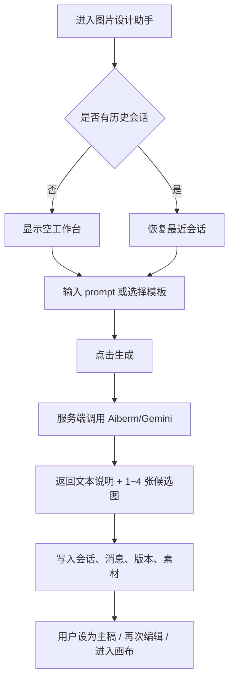
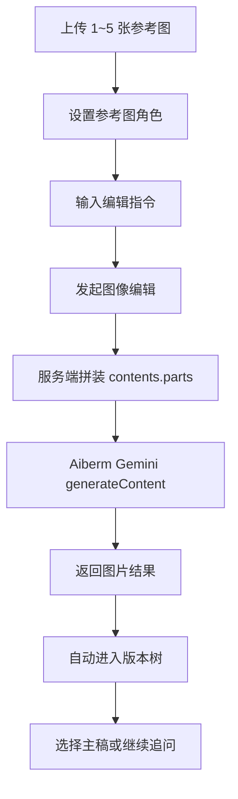
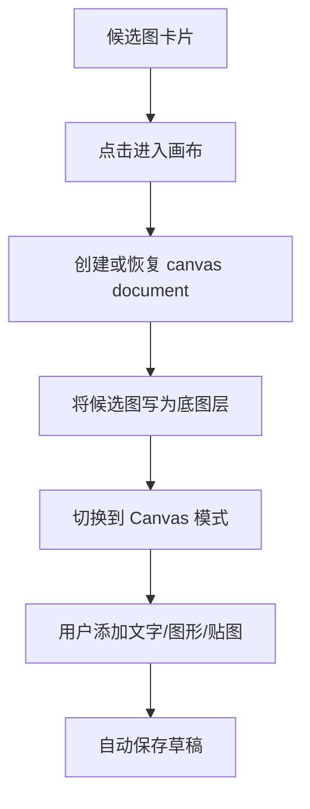
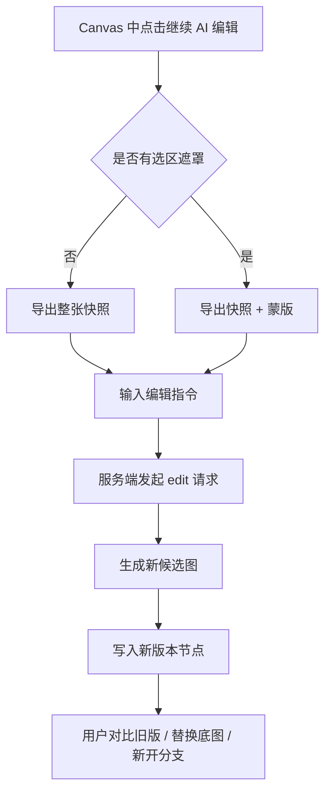
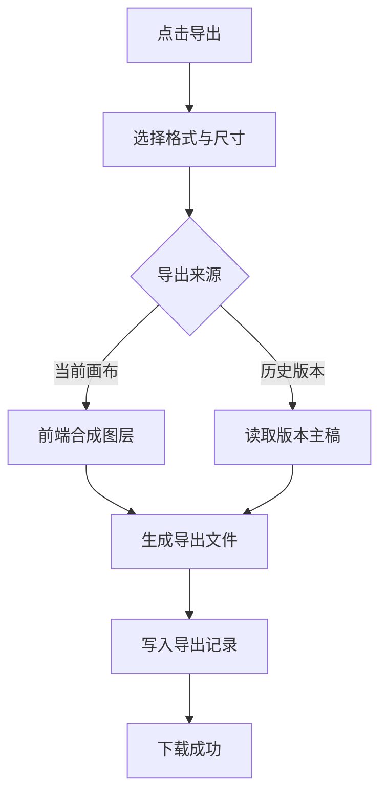

# 图片设计助手 Product Spec

**状态**: Draft for implementation  
**日期**: 2026-03-15  
**范围**: MVP / M1  
**关联文档**:
- 原始 PRD：用户提供《图片设计助手 PRD》
- 技术设计：[docs/tdd/2026-03-15-image-design-assistant-tdd.md](../tdd/2026-03-15-image-design-assistant-tdd.md)
- 数据与 API：[docs/api/2026-03-15-image-design-assistant-data-api.md](../api/2026-03-15-image-design-assistant-data-api.md)
- 研发排期：[docs/plans/2026-03-15-image-design-assistant-mvp.md](../plans/2026-03-15-image-design-assistant-mvp.md)

---

## 1. 文档目标

本文件把原始 PRD 继续细化为可直接用于 UI 设计、前后端拆分和验收的页面级原型说明与交互流程说明。  
设计原则保持不变：

1. AI 负责语义创造与大改图。
2. Canvas 负责确定性修改与局部精修。
3. 所有 AI 结果都能进入画布。
4. 所有画布结果都能回流给 AI 继续编辑。

---

## 2. 路由与导航定位

结合当前仓库已有 `dashboard + writer workspace` 模式，图片设计助手建议作为独立一级工作台接入：

- 侧栏新增一级入口：`图片设计`
- 页面路由：
  - `/dashboard/image-assistant`
  - `/dashboard/image-assistant/[sessionId]`
- 会话内通过 query 或 session state 保存当前子模式：
  - `mode=chat`
  - `mode=canvas`

导航策略：

1. 点击侧栏入口进入最近一次会话；若无会话则进入空工作台。
2. 空工作台不是单独落地页，而是工作台的空状态。
3. Chat 与 Canvas 共用同一 `sessionId`，避免分裂上下文。

---

## 3. 页面级原型说明

## 3.1 全局页面骨架

主页面延续当前 dashboard 结构，在工作区内使用三栏布局：

```text
+----------------------------------------------------------------------------------+
| Top Bar: 新建设计 | 上传图片 | Undo/Redo | 保存 | 导出 | AI/Canvas Mode Switch |
+-------------------------+--------------------------------------+-------------------+
| Left Rail               | Center Workspace                     | Right Panel       |
| 会话列表                | Chat Mode / Canvas Mode              | 参数 / 图层 / 属性 |
| 版本树                  |                                      | 导出设置           |
| 素材库                  |                                      |                   |
+-------------------------+--------------------------------------+-------------------+
```

布局原则：

- 左栏固定宽度，承担“会话、版本、素材”导航。
- 中栏是唯一主任务区，AI 对话与 Canvas 互斥显示。
- 右栏根据模式切换内容，但位置不变，降低学习成本。

---

## 3.2 页面 A：空工作台

**触发条件**
- 首次进入且无历史会话
- 用户点击“新建设计”

**页面结构**

顶部：
- 产品标题：`图片设计助手`
- 模式默认显示 `AI`
- 主按钮：`开始创作`

中部空状态卡：
- Prompt 输入框，占主视觉中心
- 上传区，支持拖拽或点击上传
- 模板 chips：
  - 海报
  - 社媒封面
  - 电商主图
  - 活动 KV
  - Banner
- 快速说明：
  - 最多 5 张参考图
  - 支持文生图 / 图生图 / 多图融合
  - 生成后可进入画布精修

右栏：
- 默认展示“生成参数”
- 可选项：
  - 候选张数
  - 尺寸预设
  - 质量模式：高质量 / 低成本

**关键动作**

1. 输入 prompt 后直接生成。
2. 上传 1 张以上图片后进入“参考编辑”路径。
3. 点击模板 chips 会自动填充 prompt 起始建议，而不是直接执行。

---

## 3.3 页面 B：AI 对话工作台

**触发条件**
- 已存在会话
- 当前模式为 `AI`

**中栏布局**

上半区：
- 消息流
- 用户消息支持显示上传缩略图
- AI 消息支持显示：
  - 文本说明
  - 结果图网格
  - 状态标签：生成中 / 成功 / 失败 / 已保存版本

下半区：
- Prompt 输入框
- 上传垫图入口
- 当前已上传参考图条带
- 快捷操作：
  - 继续改图
  - 保持主体不变
  - 更换背景
  - 改成极简风
  - 提高商业感

**单张结果卡片动作**

- 设为主稿
- 进入画布
- 再次编辑
- 对比上一版
- 下载

**右栏内容：生成参数**

- 任务类型
  - 文生图
  - 图生图
  - 多图融合
  - 风格迁移
  - 局部改图
- 参考图角色设置
  - 主体参考
  - 背景参考
  - 风格参考
  - Logo/元素参考
- 输出配置
  - 候选数 1~4
  - 尺寸预设
  - 高质量 / 低成本

**左栏内容**

- 会话列表
- 当前会话下版本树
- 素材库缩略图

---

## 3.4 页面 C：结果评审态

这是 AI 模式下的一个重点子状态，用于在“生成”和“进入画布”之间做选择。

**结果区**

- 默认宫格：1、2、4 张
- 当前主稿高亮边框
- 鼠标 hover 或移动端长按显示二级动作

**对比方式**

- 点击“对比上一版”后，在中栏右侧抽屉打开 A/B 对比
- 支持：
  - 左右并排
  - 滑杆对比

**版本树规则**

- 每次 AI 生成和 AI 编辑自动生成一个版本节点
- 一个节点可包含多个候选图
- 用户“设为主稿”后会在该节点上标记 selected candidate

---

## 3.5 页面 D：Canvas 工作台

**触发条件**
- 用户在任一候选图上点击“进入画布”
- 当前模式为 `Canvas`

**中栏布局**

中央：
- 画布区域
- 支持缩放、平移、吸附、选择框

左侧工具栏：
- 选择
- 画笔
- 橡皮
- 矩形
- 圆形
- 箭头
- 线条
- 文本
- 图片
- 遮罩

右栏：
- `图层` Tab
- `属性` Tab
- `导出` Tab

**图层面板**

- 底图层：当前 AI 主稿或当前画布快照
- 普通层：文本、图形、贴图、笔刷
- 支持：
  - 上下排序
  - 锁定
  - 隐藏
  - 删除
  - 重命名

**属性面板**

- 通用属性：
  - 位置
  - 宽高
  - 旋转
  - 透明度
- 图形：
  - 填充色
  - 描边
  - 圆角
  - 阴影
- 文本：
  - 字体
  - 字号
  - 行高
  - 字重
  - 对齐
  - 字色
- 图片：
  - 裁切
  - 圆角
  - 不透明度

**顶部操作**

- `继续 AI 编辑`
- `保存版本`
- `导出`
- `返回 AI`

---

## 3.6 页面 E：局部 AI 编辑浮层

**触发条件**
- 用户在 Canvas 中选中遮罩工具并框选区域
- 点击 `继续 AI 编辑`

**交互形式**

- 以右侧抽屉或居中弹层出现
- 内容包括：
  - 遮罩区域缩略预览
  - 指令输入框
  - 编辑模式切换：
    - 仅编辑选区
    - 引导整图重绘

**确认后系统行为**

1. 导出当前画布合成快照。
2. 导出遮罩蒙版。
3. 连同文本指令提交到服务端 AI 编辑接口。
4. 返回 1~4 张候选图。
5. 新结果自动挂到当前版本树分支下。

MVP 限制：

- M1 默认优先采用“整图重绘 + 选区引导”的策略。
- 精准 inpainting 作为 M2 增强项。

---

## 3.7 页面 F：导出弹窗

**入口**
- 顶部 `导出`
- 右栏 `导出` Tab

**字段**

- 文件格式：
  - PNG
  - JPG
  - WebP
- 尺寸预设：
  - 1:1
  - 4:5
  - 3:4
  - 16:9
  - 9:16
- 背景：
  - 保留底色
  - 透明背景

**输出来源**

- 当前画布
- 当前主稿原图
- 某历史版本

---

## 4. 模式切换规则

## 4.1 AI -> Canvas

触发动作：
- 用户点击候选图 `进入画布`

系统行为：

1. 当前候选图被设置为会话主稿。
2. 系统创建或恢复该会话的 canvas document。
3. 候选图作为底图层进入画布。
4. 中栏切换到 Canvas，左栏会话与版本信息保持不变。

## 4.2 Canvas -> AI

触发动作：
- 点击顶部 `返回 AI`
- 点击 `继续 AI 编辑`

系统行为：

1. 非破坏性保存当前画布草稿。
2. 若为“返回 AI”，只切回聊天视图。
3. 若为“继续 AI 编辑”，则导出快照并进入新的 AI 编辑链路。

---

## 5. 交互流程图

## 5.1 文生图主流程



## 5.2 垫图编辑流程



## 5.3 候选图进入画布流程



## 5.4 Canvas 回流 AI 流程



## 5.5 导出流程



---

## 6. 状态与反馈规范

## 6.1 上传态

- 单图上传中展示进度条
- 上传失败支持单张重试
- 类型或大小不合法时，就地报错，不进入会话消息流

## 6.2 生成态

- 主按钮进入 loading
- 消息流插入“AI 正在生成”占位卡
- 支持取消或超时提示

## 6.3 保存态

- Canvas 自动保存状态展示为：
  - 未保存
  - 保存中
  - 已保存
  - 保存失败

## 6.4 失败态

- 模型失败：提示“本次生成失败，可重试”
- 上传失败：提示“素材上传失败，请重新上传”
- 导出失败：提示“导出失败，请重新尝试”
- 权限不足：阻止进入工作台，并提示联系企业管理员

---

## 7. MVP 页面验收口径

上线前至少满足以下页面级标准：

1. 从空工作台可以完成文生图和图生图。
2. 上传参考图后，聊天区能展示缩略图并成功参与生成。
3. 生成结果能显示候选图卡片和版本节点。
4. 任一候选图可进入 Canvas。
5. Canvas 至少支持文本、矩形、圆形、箭头、线条、图片贴图。
6. Canvas 可保存草稿并回流给 AI 继续编辑。
7. 导出弹窗支持 PNG/JPG/WebP 与常用尺寸预设。
8. 失败、超时、空状态、无权限状态都有明确反馈。
