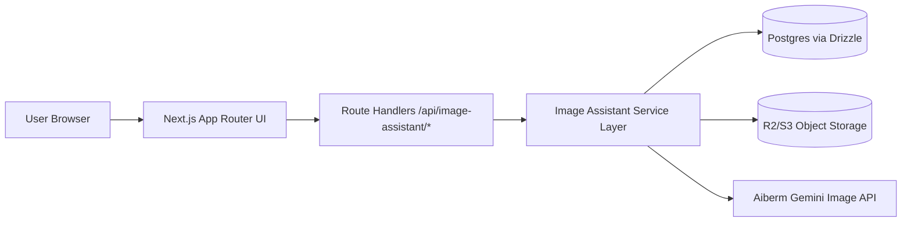

# 图片设计助手 Technical Design Document

**状态**: Draft for implementation  
**日期**: 2026-03-15  
**目标版本**: MVP / M1

---

## 1. 设计目标

在当前仓库的 Next.js App Router、Drizzle/Postgres、企业权限和对象存储能力之上，新增一个“图片设计助手”工作台，支持：

1. 文生图
2. 单图/多图参考编辑
3. 多轮对话改图
4. 结果进入 Canvas 精修
5. Canvas 快照再次回流 AI
6. 版本管理与导出

---

## 2. 非目标

MVP 不实现以下能力：

1. Figma/PSD 级矢量编辑
2. 实时多人协作
3. 精确笔刷 inpainting 引擎
4. 多页画布
5. 批量尺寸适配
6. 商业版权自动审查闭环

---

## 3. 仓库约束与复用原则

当前仓库已具备以下可复用模式：

- `app/dashboard/layout.tsx` + `components/dashboard-layout.tsx`：统一工作台容器
- `/dashboard/writer` 工作台：会话型产品的最佳参考
- `requireSessionUser()`：服务端登录态与 feature guard
- `lib/db/schema.ts`：Drizzle schema 统一管理
- `app/api/*` route handlers：Node runtime 的服务端接口层
- 对象存储上传代理与 presign 模式：`app/api/files/upload-url/route.ts`、`app/api/r2/presign-upload/route.ts`

因此，本设计遵循：

1. 不引入第二套鉴权模型。
2. 不在前端暴露 Aiberm key。
3. 不把图片编辑能力做成独立外部服务 UI。
4. 尽量复用 writer 的“会话 + 消息 + 工作台”模式。

---

## 4. 总体架构



核心原则：

- AI 生成链路由服务端串联。
- 画布交互在浏览器本地执行，保证低延迟。
- 所有可恢复的业务状态都落库。
- 文件二进制进入对象存储，数据库只存元数据和关系。

---

## 5. 前端设计

## 5.1 路由设计

新增页面：

- `app/dashboard/image-assistant/page.tsx`
- `app/dashboard/image-assistant/[sessionId]/page.tsx`

页面只做参数解包，实际状态管理集中到：

- `components/image-assistant/image-assistant-workspace.tsx`

建议新增组件目录：

- `components/image-assistant/session-sidebar.tsx`
- `components/image-assistant/version-tree.tsx`
- `components/image-assistant/asset-library.tsx`
- `components/image-assistant/chat-panel.tsx`
- `components/image-assistant/candidate-grid.tsx`
- `components/image-assistant/canvas-panel.tsx`
- `components/image-assistant/canvas-toolbar.tsx`
- `components/image-assistant/layer-panel.tsx`
- `components/image-assistant/property-panel.tsx`
- `components/image-assistant/export-dialog.tsx`

---

## 5.2 前端状态模型

工作台状态分成四层：

### A. 会话层
- 当前 `sessionId`
- 会话列表
- 当前模式 `chat | canvas`
- 当前选中版本

### B. 对话层
- 消息流
- 当前 prompt
- 当前上传参考图
- 生成参数
- 异步状态：idle / generating / editing / failed

### C. 版本层
- 版本树
- 当前主稿
- 当前候选集
- 当前分支

### D. 画布层
- 当前底图
- layer 列表
- 选中 layer
- transform 状态
- undo / redo 栈
- autosave 状态

建议实现方式：

- 外层工作台使用 `useReducer` 或拆分 `useState`
- Canvas 层单独封装为本地 store 模块
- 避免在 MVP 阶段引入额外全局状态库

原因：

1. 当前仓库没有 Zustand/Redux 依赖。
2. 该产品可以以单工作台容器维护状态，不需要全局共享。

---

## 5.3 Canvas 技术选型

MVP 推荐：

- `konva` + `react-konva`

原因：

1. 与 React 组件模型兼容较好。
2. 对文本、图形、图片、拖拽、缩放、选中框支持足够直接。
3. 画布导出 `toDataURL()` 简单，适合快照回流 AI。
4. 相较原生 canvas 自研，开发速度更高。
5. 相较 Fabric.js，React 组合和图层组件化更顺手。

MVP 覆盖能力：

- Stage / Layer / Transformer
- Rect / Circle / Arrow / Line / Text / Image
- Brush 采用自由绘制线条
- Eraser 采用“白色擦除层”或 destination-out 逻辑封装

MVP 不做：

- 贝塞尔路径编辑
- 矢量布尔运算
- 富文本排版引擎

---

## 5.4 前端交互与保存策略

### AI 模式

- 用户提交 prompt 后调用 `/api/image-assistant/generate` 或 `/edit`
- 接口返回成功后写入工作台会话和版本状态
- 当前结果卡片可直接进入 Canvas

### Canvas 模式

- 初次进入时，用当前主稿创建底图层
- 编辑过程只在本地改 layer tree
- 自动保存采用 10 秒 debounce
- 手动点击“保存版本”时，立即创建草稿版本

### Undo / Redo

- 仅针对 Canvas 本地状态
- 不回滚已经创建的 AI 版本节点

### Export

- MVP 优先前端导出
- 如遇跨域或超大图性能问题，再为 M2 增加服务端导出 fallback

---

## 6. 后端设计

## 6.1 Route Handler 分层

建议目录：

- `app/api/image-assistant/availability/route.ts`
- `app/api/image-assistant/sessions/route.ts`
- `app/api/image-assistant/sessions/[sessionId]/route.ts`
- `app/api/image-assistant/messages/route.ts`
- `app/api/image-assistant/versions/route.ts`
- `app/api/image-assistant/versions/[versionId]/restore/route.ts`
- `app/api/image-assistant/assets/upload/route.ts`
- `app/api/image-assistant/assets/[assetId]/complete/route.ts`
- `app/api/image-assistant/generate/route.ts`
- `app/api/image-assistant/edit/route.ts`
- `app/api/image-assistant/canvas/route.ts`
- `app/api/image-assistant/canvas-snapshot-edit/route.ts`
- `app/api/image-assistant/export/route.ts`

服务层建议目录：

- `lib/image-assistant/config.ts`
- `lib/image-assistant/provider.ts`
- `lib/image-assistant/aiberm.ts`
- `lib/image-assistant/repository.ts`
- `lib/image-assistant/canvas.ts`
- `lib/image-assistant/export.ts`
- `lib/image-assistant/types.ts`
- `lib/image-assistant/prompts.ts`

---

## 6.2 Provider 抽象

统一抽象：

```ts
type ImageProvider = {
  generate(input: GenerateImageInput): Promise<GenerateImageResult>
  edit(input: EditImageInput): Promise<GenerateImageResult>
}
```

MVP 默认 provider：

- `aiberm`

默认模型：

- 高质量：`gemini-3.1-flash-image-preview`
- 低成本：`gemini-3.1-flash-image-preview`

抽象必要性：

1. 便于后续扩充低成本档位。
2. 可在测试环境注入 fixture provider。
3. 避免页面层直接感知第三方请求体差异。

---

## 6.3 Aiberm 调用策略

编辑与生成统一走服务端：

- `POST https://aiberm.com/v1beta/models/{model}:generateContent`

关键实现点：

1. 文生图时：
   - `contents.parts` 只传文本指令
   - 可根据尺寸预设附加 `imageConfig`
2. 图编辑时：
   - `contents.parts` 传 `inlineData` 图片与文本指令
   - `responseModalities` 使用 `["TEXT", "IMAGE"]`
3. 多图融合时：
   - 按顺序拼装多张参考图与统一编辑指令
4. 局部编辑时：
   - M1 先把快照 + 遮罩描述 + 文本指令发给模型
   - 精准 mask inpainting 逻辑延后

超时与重试：

- 服务端超时上限：120 秒
- 网络失败最多重试 2 次
- provider 失败不自动无限重试

---

## 6.4 文件与对象存储策略

所有图片二进制统一放对象存储，数据库仅保存元信息。

素材类型：

- 用户上传参考图
- AI 生成结果图
- Canvas 快照
- Mask 位图
- 导出文件

建议对象 key 结构：

```text
image-assistant/{userId}/{sessionId}/{assetType}/{timestamp}-{random}.{ext}
```

对象存储流程：

1. 前端请求上传签名
2. 客户端直传对象存储
3. 上传完成后调用 complete 接口写入宽高、大小、状态
4. AI 生成结果由服务端写对象存储并生成 asset 记录

---

## 6.5 版本与画布闭环

版本节点统一抽象为三类：

1. `ai_generate`
2. `ai_edit`
3. `canvas_save`

闭环流程：

1. AI 生成得到版本 A
2. 用户把 A 放入 Canvas，形成 canvas document
3. 用户在 Canvas 修改并保存，得到版本 B
4. 用户对 B 发起 AI 编辑，得到版本 C
5. 版本树中 A -> B -> C 为同一分支链路

这样可以同时满足：

- 结果回滚
- 分支重开
- 前后对比

---

## 6.6 权限与运行时开关

建议新增 feature key：

- `image_design_generation`

需要同步修改：

- `lib/enterprise/constants.ts`
- `lib/runtime-features.ts`
- `components/dashboard-layout.tsx`
- `lib/auth/guards.ts`

权限规则建议：

1. 企业管理员默认有权限
2. 普通成员依赖 feature map
3. 企业待审核或已拒绝状态不可进入工作台

---

## 6.7 审计、埋点、日志

服务端日志：

- 生成开始/成功/失败
- 上传开始/成功/失败
- 导出开始/成功/失败
- 版本恢复

前端埋点：

- `image_assistant_session_created`
- `image_reference_uploaded`
- `image_generate_submitted`
- `image_generate_succeeded`
- `image_generate_failed`
- `image_canvas_opened`
- `image_canvas_layer_added`
- `image_mask_created`
- `image_ai_edit_submitted`
- `image_version_saved`
- `image_exported`

---

## 7. 性能设计

目标来自原 PRD：

- 首屏进入 <= 3s
- 首图请求超时控制 120s
- 画布操作响应 < 100ms
- 自动保存间隔 10s

实现策略：

1. 左栏会话列表分页加载，避免一次性读取全部历史
2. 版本树按会话加载，不随页面全局刷新
3. 画布层操作在本地执行，不阻塞服务端
4. 生成结果图优先加载缩略图
5. 大图进入 Canvas 前先取适合作业分辨率的渲染地址

---

## 8. 失败恢复策略

### 上传失败
- 单文件重试
- 已成功文件不回滚

### 生成失败
- 创建失败消息节点
- 保留用户输入与参考图
- 支持“重试本次请求”

### 画布保存失败
- 保留本地未保存状态
- 提示用户稍后重试
- 不丢失本地 layer tree

### 浏览器崩溃/刷新
- 恢复最近一次 autosave 的 canvas document

---

## 9. 测试策略

结合当前仓库现实，MVP 测试不建议强行引入一整套新测试框架，建议分三层：

### A. 静态检查
- `pnpm exec eslint app components lib`
- `pnpm exec tsc --noEmit`

### B. 服务层与脚本验证
- 迁移脚本执行
- 资产上传与 provider 适配 smoke test
- fixture provider 回归脚本

### C. 浏览器级验收

新增类似 writer 的 E2E runner：

- `scripts/image_assistant_e2e.py`
- `scripts/run_image_assistant_e2e_with_server.py`

验收覆盖：

1. 文生图成功
2. 上传参考图并改图成功
3. 候选图进入 Canvas
4. 添加文本/形状/贴图并保存
5. Canvas 快照继续 AI 编辑
6. 导出成功

---

## 10. 里程碑建议

### M1
- 对话生成
- 垫图编辑
- 候选图管理
- 版本历史

### M2
- 基础 Canvas
- 文本/图形/贴图
- 保存与导出

### M3
- Canvas -> AI 闭环
- 局部选区编辑
- 版本分支与对比

如果必须以单次 MVP 交付，则建议按“先能跑通闭环，再补体验”的优先级实现：

1. 会话 + 生成 + 版本
2. Canvas 基础编辑
3. Canvas 回流 AI
4. 导出与稳定性

---

## 11. 关键风险

1. AI 改图不可控
   - 通过版本树和 Canvas 精修兜底
2. 大图导出和跨域污染画布
   - 使用自有对象存储 URL 与 CORS 白名单
3. Canvas 性能抖动
   - 限制单画布图层数和贴图尺寸
4. 多候选与版本关系过于复杂
   - 用版本节点 + candidate 子表明确建模
5. 测试环境缺少真实 provider key
   - 提供 fixture provider 与 deterministic 假图数据

---

## 12. 最终结论

图片设计助手在本仓库中应被实现为一个新的、会话型、受权限控制的工作台产品。  
它不是单个 API，也不是单个 Canvas 页面，而是由以下三部分组成：

1. 对话式 AI 生图/改图工作流
2. 本地低延迟 Canvas 精修工作流
3. 以版本树为中轴的双向闭环

该设计可以最大化复用现有 writer/workspace 基础设施，同时控制 MVP 的实现范围与风险。
